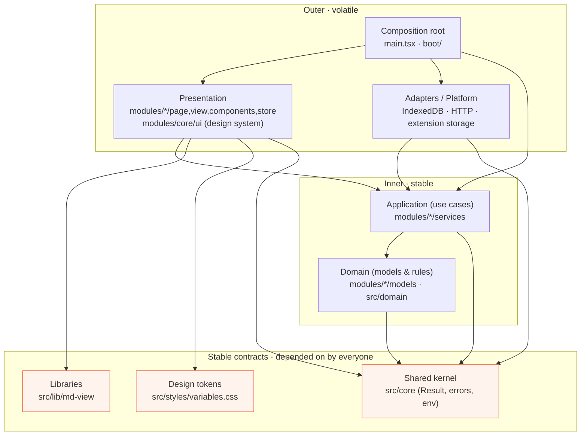

# Reader — Frontend Design Principles

> The canonical guide to **how this frontend is built** and, more importantly, **how to think** so you can make sound structural decisions on your own.
>
> Project: **Reader** (the reading product under the **do100x** brand).
> Stack: TypeScript · React 19 · React Router 7 · Vite · Tailwind CSS v4 · a functional `Result` type for errors.
> Audience: a developer who knows React + TypeScript but has **never** seen layered or domain-driven architecture. Every term is defined in plain language before it is used.

---

## ⏱️ 2-minute TL;DR

You are working on a calm reading app. People paste or save articles (we call each one a **Page**), read them distraction-free, and — soon — highlight, look words up, chat with an AI about the text, and review with quizzes. Today everything is stored **in the browser** (IndexedDB). Later there will be a **backend**, then a **desktop app**, a **mobile app**, and a **browser extension**. The app might also be **paused or abandoned** at any time.

Those facts — *backend later, many platforms later, maybe never* — are the whole reason the code is shaped the way it is. We don't know how big this gets, so we don't optimize for size. We optimize so that **change stays cheap** and **any piece can be deleted**.

The shape, in one breath:

- **Stable things in the middle, volatile things at the edges.** Design tokens (colors, spacing), shared types, and pure libraries sit at the centre. UI and storage code sit at the edges. Edges depend on the middle; the middle never depends on the edges.
- **Features are vertical slices.** A feature like `reader` owns its own UI, state, and logic. It does not reach into another feature's guts.
- **One job per place.** A React component shows things. A *service* makes decisions and talks to storage. They never swap jobs — a component must never open the database itself.
- **Boundaries are folders + import rules today**, packages tomorrow. We draw the line first and only build the wall when a second person needs to stand on the other side of it.
- **Errors are returned, not thrown.** A function that can fail returns a `Result` — a value that is either `ok` or an error. You can't forget to handle it, because TypeScript won't let you.

Read Part I for the *why*, skim Part II for the map, and keep Part III + Part IX open while you code.

---

## 🧭 How to read this guide

This document is two things at once:

1. **A teaching text** — read it top to bottom, once, in a sitting. It assumes zero knowledge of "architecture" as a discipline and builds every idea from the ground up, with a real-world analogy and a real example from *this* app for every concept.
2. **A reference** — after that first read, jump to the part you need. The glossary (Part III), the boundary matrix (Part VIII), the decision trees (Part IX), and the recipes (Part XI) are built for lookup.

A few conventions:

- **Why → What → How.** Every section explains *why* something exists before *what* it is and *how* to use it. If you only remember the why, you can re-derive the rest.
- **❌ / ✅ blocks** show a wrong version then the fixed version. Read both.
- Boxes like the one below are **hard rules** — the kind a reviewer will point to.

> 🚧 **Hard rule:** Dependencies point *inward only*. Outer layers know about inner layers; inner layers never know about outer layers. This is the single most important sentence in the document. We'll unpack it in Part II.

- Look for the **🛠️ Planned** marker. Some folders in this repo are intentionally **empty or thin right now** (`src/core/errors`, `src/domain`, `modules/reader/chat`, auth). They are *lines drawn for the future*. Where you see 🛠️ **Planned**, the code does not exist yet — the section shows you exactly where it will go and what it will look like, using patterns the repo already uses.

---

## 📚 Table of contents

- [Part I — Mindset: the seven ideas everything rests on](#part-i--mindset-the-seven-ideas-everything-rests-on)
- [Part II — The big picture: the Dependency Rule](#part-ii--the-big-picture-the-dependency-rule)
- [Part III — The vocabulary (glossary)](#part-iii--the-vocabulary-glossary)
- [Part IV — Layer-by-layer, mapped to real folders](#part-iv--layer-by-layer-mapped-to-real-folders)
- [Part V — A request's journey, end to end](#part-v--a-requests-journey-end-to-end)
- [Part VI — Cross-cutting concerns](#part-vi--cross-cutting-concerns)
- [Part VII — Naming conventions](#part-vii--naming-conventions)
- [Part VIII — The boundary rules (what may import what)](#part-viii--the-boundary-rules-what-may-import-what)
- [Part IX — Decision guides](#part-ix--decision-guides)
- [Part X — Scaling & the multi-platform story](#part-x--scaling--the-multi-platform-story)
- [Part XI — The cheap-to-change playbook](#part-xi--the-cheap-to-change-playbook)
- [Part XII — Anti-patterns & code smells](#part-xii--anti-patterns--code-smells)
- [Part XIII — FAQ for juniors](#part-xiii--faq-for-juniors)
- [Part XIV — Checklists](#part-xiv--checklists)
- [Appendix — Further reading](#appendix--further-reading)

---

# Part I — Mindset: the seven ideas everything rests on

Before a single folder name, you need the *worldview*. Architecture is not a pile of rules to memorize; it is a small set of bets about the future. Get the bets right and the rules write themselves. Here are the seven bets this project makes.

## 1. Architect for change, not for scale

**Why.** You cannot predict how big Reader gets. Maybe ten users, maybe ten million. If you design today for ten million — sharding, queues, micro-frontends — you'll spend months building machinery for a future that may never arrive, and the project "may be paused or abandoned" before any of it pays off. But there is one thing you *can* predict with total confidence: **the code will change.** Requirements will shift, the backend will land, a second platform will appear. So we don't optimize for scale (a guess). We optimize for **cheap change** (a certainty).

**Analogy.** Think of **city planning versus designing a single building**. A building is optimized for a fixed purpose and a known capacity; change its use and you gut it. A *city* is planned so that a corner shop can become a café, then a bookstore, then flats — without demolishing the block. Good architecture zones the land so the buildings can change. We are planning a city, not pouring one giant foundation.

**In Reader.** We don't know if "review with quizzes" will be huge or cut. So `review` will be its own slice that can grow or be deleted in an afternoon, rather than threaded through everything.

## 2. Cut boundaries on the axes of change

**Why.** The most useful question in all of architecture is: *"What changes together, and what changes for different reasons?"* Code that changes together should live together. Code that changes for *different* reasons should live apart. When you get this right, a typical change touches **one folder**. When you get it wrong, a one-line feature edit ripples through ten files.

**Analogy.** Organize a kitchen by **task stations**, not by material. You don't put "all metal things" in one drawer and "all plastic things" in another — you put the *coffee* things together (beans, grinder, filters, mug) because you reach for them at the same moment, for the same reason. A "reason to reach" is an axis of change.

**In Reader.** Everything about *reading a document* — the viewer, the table of contents, the font controls, the reading themes — changes for the same reason (we're improving the reading experience), so it all lives in `modules/reader`. Everything about *the look of a button* changes for a different reason (brand/design updates), so it lives in the design system (`modules/core/ui`). Two reasons, two homes.

> 🧠 **The test:** Before adding code, ask *"when this needs to change, what will the reason be?"* Put it with the other code that changes for that same reason.

## 3. Depend on small, stable contracts — not on implementations

**Why.** If module A uses module B's *internals*, then every time B changes inside, A breaks. But if A only depends on a small, **stable promise** that B makes — a type, a function signature, a CSS variable name — then B can change its insides freely. The promise is called a **contract**. Depending on contracts instead of implementations is what lets parts evolve independently.

**Analogy.** **A wall socket.** Your lamp depends on the *shape of the socket* (the contract), not on the power station behind the wall. The utility can switch from coal to solar overnight; your lamp neither knows nor cares, because the socket's shape is a stable promise.

**In Reader.** Every button, card, and border in the app reads colors from **design tokens** — CSS variables like `var(--color-brand)` (defined in [`src/styles/variables.css`](src/styles/variables.css)). The token name is the socket. We can change coral's exact hex, or flip the whole app to dark mode, and nothing that *uses* the token has to change. **Universal dependence on a stable contract like the token set is not a leak — it is the design working as intended.** Same idea, later, with **ports**: a feature will depend on the *promise* "you can save a Page," not on the fact that today it's IndexedDB.

## 4. Draw the lines now, extract the walls later

**Why.** There is a real cost to splitting code into separate published packages too early: versioning, build steps, release coordination. But there is *also* a cost to having no boundaries at all: everything tangles. The resolution: **draw the boundary as a cheap thing now (a folder + an import rule), and promote it to an expensive thing (a package) only when a second consumer actually exists.**

**Analogy.** An architect chalks the room layout on the concrete slab before any walls go up. The chalk lines are nearly free and easy to redraw. You pour the walls only once you're sure where the rooms go.

**In Reader.** The boundaries today are **folders** under `src/` plus **path aliases** (`@modules`, `@lib`, `@core`…) and (soon) **lint rules** that forbid the wrong imports. That's the chalk. When the desktop app arrives and a *second* program needs the reader logic, we "pour the wall" by lifting that folder into a real package under `packages/`. Part X is the step-by-step for that promotion.

## 5. Add an abstraction only when the second implementation is known (the Rule of Three)

**Why.** An abstraction (an interface, a generic wrapper, a "pluggable" layer) is a bet that things will vary. If you add it before you know *how* they'll vary, you almost always guess the shape wrong — and **the wrong abstraction is more expensive than no abstraction**, because everyone now has to bend their code around a fiction. Wait until you have two (ideally three) real cases. Then the right shape is obvious, because you can see it.

**Analogy.** Don't build a universal remote for the one TV you own. Buy the second device first; *then* you know what the remote actually needs to do.

**In Reader — a live example.** Right now, saving a Page is done directly with IndexedDB inside [`src/modules/pages/services/page-service.ts`](src/modules/pages/services/page-service.ts). There is **no `PageRepository` interface yet**, and that is *correct* — there is only one way to store a Page today. The moment the backend arrives, we'll have a *second* implementation (HTTP), and *that* is when we introduce the interface and two adapters. Building the interface now would be guessing. (See Part XI's "Add the backend" recipe.)

> 🧠 **Rule of Three:** First time, just write it. Second time, notice the duplication and wince. Third time, *now* abstract — you finally know the shape.

## 6. Optimize for deletability and replaceability over reuse

**Why.** "Reuse" sounds like the highest virtue, but reuse creates coupling: the more places share a piece, the harder it is to change or remove. Because this project "may be paused or abandoned" and features may be cut, the higher virtue here is that **any feature can be deleted in an afternoon without leaving a wound.** A slice you can delete cleanly is a slice you understood completely.

**Analogy.** **LEGO versus a welded sculpture.** A LEGO block does one thing, connects through standard studs, and pops off without damage. A welded joint is "reused" steel — and removing one piece means cutting and grinding. Build with blocks.

**In Reader.** If we kill the `review` feature, deleting `modules/review/` and its one route line should be the whole job. That's only possible because other features depend on small shared contracts (tokens, types), not on `review`'s internals.

## 7. Refactoring is normal, healthy, and expected

**Why.** Architecture is not something you get *right once* and freeze. It's a garden you prune. The goal is **not** "never restructure." The goal is that **when you do restructure, it takes weeks, not months.** If moving a feature or swapping storage would take months, the architecture has failed — not because it needs restructuring, but because restructuring is too expensive.

**Analogy.** Pruning a tree isn't damage; it's maintenance that keeps the tree healthy. A codebase that's never refactored is a tree that's never pruned — it gets tangled and sick.

**In Reader.** You will see, in this very codebase, places that don't yet follow the target shape — for example, `page-service.ts` currently `throw`s errors instead of returning a `Result`, and the pure `domain/` folder is still empty while logic lives in `modules/`. That's not failure; that's a garden mid-prune. Part XII shows the ❌→✅ moves. Doing them should feel routine, not heroic.

> 💡 **If you remember one thing from Part I:** We are buying *optionality*. Every boundary exists so that a future decision (backend, platform, cut a feature) stays cheap. When a rule in this doc feels like overhead, ask "which future change does this keep cheap?" — that's always the answer.

---

# Part II — The big picture: the Dependency Rule

Now the map. Almost every "layered architecture" you'll ever read about — Clean Architecture, Hexagonal/Ports-and-Adapters, Onion, Domain-Driven Design — is a different drawing of **one single idea**:

> 🚧 **The Dependency Rule (the one golden rule of imports):**
> **Source code dependencies point *inward only*, toward stability.** An outer ring may import from an inner ring. An inner ring must **never** import from an outer ring.

Everything else is detail. Let's make "inner" and "outer" concrete.

## Stable in the centre, volatile at the edges

Arrange the code as rings. The **centre** holds the things that change *least often* and are depended on by *the most* code. The **edges** hold the things that change *most often* (UI, storage technology) and are depended on by *the least* code.

```
                ┌─────────────────────────────────────────────────────┐
   OUTER /      │  Composition root  →  src/main.tsx, src/boot/        │
   most         │  (wires everything together; knows about all rings)  │
   volatile     │ ┌─────────────────────────────────────────────────┐ │
                │ │  Presentation (UI)                               │ │
                │ │  modules/*/page.tsx, view.tsx, components/,      │ │
                │ │  store/  +  the design system modules/core/ui    │ │
                │ │ ┌─────────────────────────────────────────────┐ │ │
                │ │ │  Adapters / Platform (the "edge" of logic)  │ │ │
                │ │ │  IndexedDB / HTTP / chrome.storage code      │ │ │
                │ │ │ ┌─────────────────────────────────────────┐ │ │ │
                │ │ │ │  Application (use cases)                 │ │ │ │
                │ │ │ │  modules/*/services/*                    │ │ │ │
                │ │ │ │ ┌─────────────────────────────────────┐ │ │ │ │
                │ │ │ │ │  Domain  (pure rules & models)      │ │ │ │ │
                │ │ │ │ │  modules/*/models/*, src/domain/    │ │ │ │ │
                │ │ │ │ └─────────────────────────────────────┘ │ │ │ │
                │ │ │ └─────────────────────────────────────────┘ │ │ │
                │ │ └─────────────────────────────────────────────┘ │ │
                │ └─────────────────────────────────────────────────┘ │
                └─────────────────────────────────────────────────────┘

   ACROSS ALL RINGS (the stable contracts everyone may depend on):
   • Design tokens    src/styles/variables.css   (CSS variables)
   • Shared kernel    src/core/                   (Result, errors, env, shared types)
   • Libraries        src/lib/                    (e.g. md-view markdown renderer)
```

The same picture as a dependency graph (an arrow means "is allowed to import"):



## Why "inward only"? The intuition

The inner rings are **the part of the app that would still make sense if you deleted React, deleted the browser, deleted IndexedDB.** "A Page has an id, a title, and content" is true on the web, on desktop, on mobile, in a unit test with no DOM at all. That truth shouldn't depend on a button or a database — because buttons and databases are exactly the things we plan to swap.

So:

- A **domain model** (`Page`) must not import a React component. (Inner can't see outer.)
- A React component **may** import a domain model and call a service. (Outer can see inner.)
- A storage adapter (IndexedDB) **may** import the application/domain types it stores. (Outer → inner.)
- The application/domain must **not** import the IndexedDB code directly — it depends on the *contract* (a port), and the adapter is plugged in from the outside. (This is the part the repo will grow into; see Parts III, IV, XI.)

> 🚧 **Hard rule, restated for imports:** A file in `src/domain` or `modules/*/models` may import from `@core` (kernel) and nothing else app-specific. It may **never** import from `@modules/*/components`, `@lib`, `react`, or a storage library. If you feel the urge, the code you're writing isn't domain — it's presentation or adapter code wearing a disguise.

## The three "everyone may use these" contracts

Notice the bottom band of the diagram: **design tokens, the shared kernel, and libraries.** These are special. They sit *outside* the ring rule because they are **stable contracts with no app-specific dependencies of their own.** Every ring is allowed to depend on them, and that universal dependence is healthy (Idea #3). They are cheap to depend on precisely because they depend on nothing themselves — changing them is rare and deliberate.

Keep this whole picture in your head as one sentence: **outer depends on inner; everyone may depend on the stable contracts; nothing stable depends on anything volatile.** The rest of this document is that sentence, applied.

---

# Part III — The vocabulary (glossary)

This is the part to bookmark. Architecture has a lot of jargon, and most of it is intimidating only because nobody defined it plainly. Here we fix that. **Every term gets the same eight questions**, in the same order:

1. **Plain definition** — one or two sentences.
2. **Why it's named that** — where the word comes from and why this layer earns it.
3. **Single responsibility** — its one job.
4. **What belongs here** — with real Reader examples.
5. **What must NEVER go here** — and the concrete reason.
6. **Analogy** — something non-software.
7. **Code example** — in this project's real idioms (`Result`, functions, composition).
8. **Common junior mistakes.**

A quick note before we start: a few of these layers (ports, adapters, a pure domain) are **🛠️ Planned** — drawn but not yet built in the repo. They're included because you need the vocabulary *now* to make today's decisions in a way that won't fight tomorrow. Each planned term says so.

---

## 3.1 Domain

1. **Plain definition.** The domain is the **pure description of the problem you're solving** — the nouns, the rules, and the facts that would be true even if there were no screen and no database. For Reader, the domain is things like "a Page has a title and content," "a document splits into Sections by its headings," "a highlight covers a range of text."
2. **Why it's named that.** "Domain" comes from Latin *dominus*, "lord/owner" — your *domain* is the territory you have authority over. In software it's borrowed from the phrase **"problem domain"**: the subject area the software is *about*. The reading domain is the realm of documents, sections, and highlights — not of buttons or databases.
3. **Single responsibility.** Express the truths and rules of reading, in plain TypeScript, depending on nothing volatile.
4. **What belongs here.** Entities and value objects (`Page`, `Section`, a future `Highlight`); pure rules and calculations (how a document is divided into sections — the logic in [`section-parser.ts`](src/modules/reader/services/section-parser.ts) is *domain logic* even though it currently sits beside other service code). In this repo the reserved home is [`src/domain/`](src/domain) (and per-feature `models/`), with `src/domain/reader/` 🛠️ **Planned** for the platform-agnostic reader core.
5. **What must NEVER go here.** No React, no `fetch`/`axios`, no IndexedDB, no `localStorage`, no CSS. **Reason:** the domain is the one part we want to reuse *unchanged* on web, desktop, mobile, and extension. The instant it imports a browser API, it stops being portable and the whole point is lost.
6. **Analogy.** The **rules of chess.** "A bishop moves diagonally" is true on a wooden board, a phone screen, or in your head. The rules don't mention pixels or wood. That's a domain.
7. **Code example.**
```ts
// src/modules/pages/models/page.ts — a domain model: pure data, zero dependencies
export interface Page {
    id: string;
    title: string;
    content: string;   // markdown
    createdAt: string; // ISO timestamp
}
```
8. **Common junior mistakes.** Putting a `useState` or a `className` in a "model" file; importing `axios` "just to fetch the page here"; making the domain depend on the shape of an API response. If your model knows what JSON the server sends, the server now controls your domain.

---

## 3.2 Application (use cases)

1. **Plain definition.** The application layer holds the **use cases** — the specific things a user can *do*, expressed as a sequence of steps. "Create a page," "open a page," "parse a document into sections." It orchestrates the domain and storage to get a job done, but contains no UI and no storage details itself.
2. **Why it's named that.** From "to **apply**" — this layer *applies* the domain's rules to accomplish a real goal. The domain knows *what is true*; the application layer *puts it to use*. Each function is literally a use case: a use of the system.
3. **Single responsibility.** Carry out one user intention end-to-end by coordinating domain + ports — and return a `Result` saying how it went.
4. **What belongs here.** The verbs of the app: `createPage`, `getPage`, `editPage`, `deletePage`, `queryPages` in [`page-service.ts`](src/modules/pages/services/page-service.ts); `parseSections` / `flattenSections` in [`section-parser.ts`](src/modules/reader/services/section-parser.ts). These live in each feature's `services/` folder.
5. **What must NEVER go here.** No JSX, no DOM events, no token/color values. **Reason:** use cases must be callable from *any* surface — a web component today, an Electron menu or a CLI tomorrow. The moment a use case renders a `<div>`, it can only be used from React.
6. **Analogy.** A **recipe**. The recipe ("sauté onions, add stock, simmer 20 min") is the use case. It assumes you *have* a stove (a port) but doesn't care whether it's gas or induction (the adapter). And it never describes how the plate is decorated (the UI).
7. **Code example.** A use case orchestrates and returns a `Result` rather than throwing (see Part VI):
```ts
// Target shape for a use case: pure orchestration, errors as values.
import { ok, err, type AsyncResult } from '@raghava.indra/result-ts';
import type { Page, PageCreateInput } from '@modules/pages/models/page';
import { ApiError } from '@core/errors';

export async function createPage(
    input: PageCreateInput,
    repo: PageRepository,            // a port, injected — not IndexedDB directly
): AsyncResult<Page, ApiError> {
    if (!input.title.trim()) {
        return err(new ApiError('Title is required', 'PAGE_TITLE_REQUIRED'));
    }
    return repo.add({ ...input, id: crypto.randomUUID(), createdAt: new Date().toISOString() });
}
```
8. **Common junior mistakes.** Letting the use case `new`-up IndexedDB itself (that couples it to the web platform); returning raw data and `throw`ing on failure instead of returning a `Result`; stuffing formatting/display logic ("show '3 days ago'") in here — that's presentation.

---

## 3.3 Ports — 🛠️ Planned

1. **Plain definition.** A **port** is an *interface* (a TypeScript `interface` or function type) that the inner layers define to say **"I need a capability shaped like this"** — without saying who provides it. Example: "I need to be able to save and load Pages." The port is the promise; it has no body.
2. **Why it's named that.** From **Hexagonal Architecture** (Alistair Cockburn), which pictures the app as a hexagon with *ports* on its sides — like the ports on a computer. A USB port defines a *shape*; any device matching that shape plugs in. A software port defines a *type*; any implementation matching it plugs in.
3. **Single responsibility.** Declare a capability the application needs, as a stable contract, so the actual provider can be swapped without touching the application.
4. **What belongs here.** Interface declarations owned by the inner layer: `PageRepository` ("save/load/delete Pages"), a future `DictionaryPort` ("define a word"), a future `ChatPort` ("send messages to an AI"), a future `UserRepository` ("who is the current user"). These will live next to the feature that needs them (e.g. `modules/pages/ports/page-repository.ts`).
5. **What must NEVER go here.** No implementation — no IndexedDB, no `fetch`. **Reason:** a port with an implementation inside is no longer a swappable contract; it's just code with extra steps. Keep it bodiless.
6. **Analogy.** **A power socket on the wall.** The socket defines the shape and voltage. It doesn't care whether a lamp, a charger, or a vacuum plugs in. The socket is the port; the appliances are adapters.
7. **Code example.**
```ts
// src/modules/pages/ports/page-repository.ts  (🛠️ introduced when a 2nd store appears)
import type { AsyncResult } from '@raghava.indra/result-ts';
import type { Page, PageCreateInput } from '../models/page';
import type { ApiError } from '@core/errors';

export interface PageRepository {
    add(page: Page): AsyncResult<Page, ApiError>;
    getById(id: string): AsyncResult<Page | null, ApiError>;
    getAll(): AsyncResult<Page[], ApiError>;
    delete(id: string): AsyncResult<void, ApiError>;
}
```
8. **Common junior mistakes.** Creating the port *before* there's a second implementation (premature — see Rule of Three; today IndexedDB is the only store, so the port can wait); defining the port in terms of the database ("`runSql(...)`") instead of the domain need ("`getById(...)`") — a leaky port just relocates the coupling.

---

## 3.4 Adapters — 🛠️ Planned

1. **Plain definition.** An **adapter** is a concrete implementation of a port — the code that actually fulfils the promise using a specific technology. An `IndexedDbPageRepository` and an `HttpPageRepository` are two adapters for the one `PageRepository` port.
2. **Why it's named that.** Like a **travel power adapter**: it converts the shape of the outside world (a UK plug, a REST API, IndexedDB's event-based API) into the shape the inside expects (the port). The word literally means "something that adapts one interface to another."
3. **Single responsibility.** Translate between a port (what the app wants) and a real external system (what's actually there), and convert that system's failures into our typed errors.
4. **What belongs here.** The IndexedDB code currently inside [`page-service.ts`](src/modules/pages/services/page-service.ts) (`openDB`, `withTransaction`, the `store.add/get/put/delete` calls) is adapter code — today it's mixed into the service; tomorrow it moves to `modules/pages/adapters/indexeddb-page-repository.ts`. A future `HttpPageRepository` (using `axios`) and a future extension `chrome.storage` repository are also adapters.
5. **What must NEVER go here.** No business rules ("a title must be non-empty" belongs in the use case/domain) and no UI. **Reason:** if rules live in the adapter, every new platform re-implements (and subtly breaks) them. Adapters should be *dumb translators*.
6. **Analogy.** A **translator** at a meeting. The translator doesn't decide policy (rules) or design the slides (UI); they only convert one language to another faithfully. Swap the translator and the meeting's content is unchanged.
7. **Code example.**
```ts
// src/modules/pages/adapters/indexeddb-page-repository.ts (🛠️) — implements the port
import { fromPromise, type AsyncResult } from '@raghava.indra/result-ts';
import { ApiError } from '@core/errors';
import type { PageRepository } from '../ports/page-repository';
import type { Page } from '../models/page';

export function createIndexedDbPageRepository(): PageRepository {
    return {
        getById: (id) =>
            fromPromise(
                withTransaction<Page | null>('readonly', (store) => store.get(id)),
                (cause) => new ApiError('Failed to read page', 'PAGE_READ_FAILED', { cause }),
            ),
        // ...add, getAll, delete
    };
}
```
8. **Common junior mistakes.** Letting an adapter leak its technology upward (returning a raw `IDBRequest` or an `AxiosResponse` instead of a domain `Page`); throwing the raw library error instead of wrapping it in an `ApiError`; putting validation here instead of in the use case.

---

## 3.5 Infrastructure ("infra")

1. **Plain definition.** Infrastructure is the **technical plumbing the app stands on**: the database, the network client, the file system, the framework wiring. In a textbook it's the outer ring where all the "real world" lives.
2. **Why it's named that.** *Infra-* is Latin for "below." Infrastructure is the *structure beneath* — the wiring and pipes under the floor that you don't see but everything relies on. Same word as a city's infrastructure (roads, water, power).
3. **Single responsibility.** Provide the low-level technical capabilities (storage, transport, env config) that adapters use to do their job.
4. **What belongs here.** The IndexedDB plumbing (`openDB`, `withTransaction`), the `axios` HTTP setup (when added), and arguably the env loader [`src/core/models/env.ts`](src/core/models/env.ts) which reads `/env.json` and validates it with `zod`.
5. **What must NEVER go here.** Domain rules and UI. **Reason:** infrastructure is the *most* replaceable layer (we will literally swap IndexedDB for HTTP). Anything valuable trapped in here dies when the technology is swapped.
6. **Analogy.** The **plumbing behind the wall.** You care that water comes out of the tap (the port), not which brand of pipe runs behind the plaster. When you renovate, you replace the pipes without redesigning the kitchen.
7. **Code example.**
```ts
// src/modules/pages/services/page-service.ts — IndexedDB plumbing (infrastructure today)
function openDB(): Promise<IDBDatabase> {
    return new Promise((resolve, reject) => {
        const request = indexedDB.open('reader-db', 1);
        request.onupgradeneeded = () => { /* create 'pages' object store + indexes */ };
        request.onsuccess = () => resolve(request.result);
        request.onerror = () => reject(request.error);
    });
}
```
8. **Common junior mistakes.** Importing infrastructure directly from a component (the component should call a *use case*, never `openDB`); treating "infrastructure" as a junk drawer for anything that doesn't fit elsewhere.

---

## 3.6 Platform — (and how it relates to "infrastructure")

1. **Plain definition.** The **platform** layer is the per-runtime, environment-specific code: what differs between **web, desktop (Electron), mobile, and the browser extension.** On web, storage is IndexedDB; on extension, it's `chrome.storage`; on desktop, maybe SQLite. The platform layer is where those differences are quarantined.
2. **Why it's named that.** "Platform" comes from French *plate-forme*, "flat form" — the **stage you stand on.** Your code performs on a stage; the stage (web/desktop/mobile) provides the floor. We call this layer "platform" rather than "infrastructure" because in *this* project the **axis of change is which platform we run on** (Idea #2). Naming the layer after its reason-to-change keeps the intent obvious.
3. **Single responsibility.** Hold the implementations that vary by runtime, behind the same ports, so the rest of the app is written once and runs everywhere.

> 🔑 **"Platform" vs "infrastructure" — reconciled.** They are **the same ring of the diagram, named for two different emphases.**
> - **Infrastructure** is the *classic Clean/DDD term* and stresses *technical level*: "this is low-level plumbing (DB, network) as opposed to high-level rules."
> - **Platform** stresses *reason to vary*: "this is the stuff that's different per runtime target."
> In Reader, both describe the outermost ring (adapters + their plumbing). **Prefer "platform"** here, because our defining future change is *adding platforms*, and the word makes the team think "this must stay swappable per target." Reach for "infrastructure" only when you specifically mean generic low-level plumbing that isn't really platform-specific (e.g. a logging helper). Adapters live in this ring under *either* name; "adapter" is the Hexagonal word for the *implementations*, "platform/infrastructure" is the word for the *ring they live in*.

4. **What belongs here.** Platform-specific adapters and shims: the IndexedDB `PageRepository` (web), a future `chrome.storage` repository (extension), a future Electron/SQLite repository (desktop), a clipboard/paste shim, a speech-to-text bridge. Likely future home: `modules/<feature>/adapters/` per feature, or a top-level `src/platform/<target>/` once a real second target exists.
5. **What must NEVER go here.** Anything platform-*agnostic* — the domain, the use cases, the design tokens. **Reason:** code in the platform layer is, by definition, rewritten for each target. Put portable code here and you'll port it four times.
6. **Analogy.** **Shoes for terrain.** Your *body and your route* (domain + use cases) don't change; your *shoes* do — trainers on road, boots on trail, crampons on ice. The platform layer is the shoes: same hiker, swapped footwear per ground.
7. **Code example.** Same port, two platform adapters, chosen once at the composition root:
```ts
// Web build wires the web adapter:
const pageRepo = createIndexedDbPageRepository();      // src/platform/web (🛠️)
// Extension build wires another, with zero changes to use cases or UI:
const pageRepo = createChromeStoragePageRepository();  // src/platform/extension (🛠️)
```
8. **Common junior mistakes.** Sprinkling `if (isElectron)` checks throughout components instead of selecting one adapter at the composition root; confusing "platform" (runtime target) with "design system" (the UI primitives) — they're unrelated.

---

## 3.7 Presentation / UI

1. **Plain definition.** The presentation layer is **everything the user sees and touches** — React components, screens, dialogs, the table of contents, the font buttons — plus the local UI state that drives them.
2. **Why it's named that.** From "to **present**": this layer *presents* the application to a human. It's also called the UI (user interface) — the *interface* between the person and the system.
3. **Single responsibility.** Turn application state into pixels, and turn user gestures (clicks, pastes, keypresses) into calls to use cases. **Show and capture — never decide or persist.**
4. **What belongs here.** `page.tsx` (route entry) and `view.tsx` (composition) for each feature; presentational components in `components/` ([`appbar.tsx`](src/modules/reader/components/appbar.tsx), [`toc.tsx`](src/modules/reader/components/toc.tsx), [`settings-panel.tsx`](src/modules/reader/components/settings-panel.tsx)); UI state stores like [`reader-settings.tsx`](src/modules/reader/store/reader-settings.tsx); and the shared **design system** in [`modules/core/ui`](src/modules/core/ui) (Button, Dialog, Input…).
5. **What must NEVER go here.** Direct database/network calls and business rules. **Reason:** a component that calls `indexedDB.open()` can't be reused on a platform without IndexedDB, can't be tested without a fake DB, and hides a decision where nobody looks for it. Components call *services*; services do the work.
6. **Analogy.** A **restaurant's dining room.** The waiter (UI) takes your order and brings your food, beautifully plated. The waiter does not cook (use cases) or farm the vegetables (infrastructure). A waiter who runs to the field to pick tomatoes is a broken restaurant.
7. **Code example.** A component captures intent and delegates; it does not persist:
```tsx
// src/modules/home/view.tsx (excerpt) — UI calls a use case, then navigates
const handleCreate = async (title: string, content: string) => {
    const page = await createPage({ title, content }); // delegate to the service
    navigate(`/reader/${page.id}`);                     // pure presentation concern
};
```
8. **Common junior mistakes.** Opening the database in a `useEffect`; putting "a title must be unique" validation in the dialog instead of the use case; importing another feature's *component* to reuse a bit of markup (copy it or lift it to the design system instead — see Part XII).

---

## 3.8 Shared / kernel

1. **Plain definition.** The **kernel** (here, [`src/core/`](src/core)) is the tiny set of truly universal building blocks every part of the app may use: the `Result` type, the error classes, shared types, the env config. It's "shared" code — but a *disciplined*, minimal kind of sharing.
2. **Why it's named that.** "Kernel" is Old English *cyrnel*, "a little seed/corn" — the small, hard core inside a shell. It's the *seed* the whole app grows around. "Shared kernel" is also a precise **Domain-Driven Design** term (Eric Evans) for a small model that two contexts *agree* to share and co-own carefully.
3. **Single responsibility.** Provide the few cross-cutting primitives that everything depends on, while itself depending on (almost) nothing — so it stays rock-stable.
4. **What belongs here.** The `Result` helpers (via the `@raghava.indra/result-ts` package), the error hierarchy (`AppError`, `ApiError`, `DomainError` — 🛠️ to live in [`src/core/errors`](src/core/errors)), and shared config like [`env.ts`](src/modules/../core/models/env.ts). Accessed through the `@core` alias.
5. **What must NEVER go here.** Feature-specific logic and UI. **Reason:** the kernel is imported by *everyone*, including the domain. If feature code or React leaks in, you've coupled the entire app to one feature, and made the most-depended-on layer the most volatile — the exact opposite of its job.
6. **Analogy.** **SI units and the metric system.** Metres and grams are shared by every science, defined once, changed almost never. You don't put "rules of biology" into the definition of a metre. The kernel is the unit system; features are the sciences.
7. **Code example.**
```ts
// Used everywhere, depends on nothing app-specific:
import { ok, err, type Result } from '@raghava.indra/result-ts';
import { DomainError } from '@core/errors';   // 🛠️ planned base errors

export type Validated<T> = Result<T, DomainError>;
```
8. **Common junior mistakes.** Turning `core` into a junk drawer ("utils") full of feature bits; importing a feature into the kernel "just this once" (now the kernel can't be understood or moved without that feature). Keep it small enough to hold in your head.

> 🔎 **Two things called "core" — don't confuse them.** This repo has **`src/core/`** (the kernel: pure TypeScript — `Result`, errors, env; **no React**) *and* **`src/modules/core/`** (the shared **UI module**: Button, Dialog, theme — very much React). Same word, different rings. Rule of thumb: **`@core` = brain (pure logic), `@modules/core` = face (shared UI).** When you import, the alias tells you which one you're touching.

---

## 3.9 Library ("lib")

1. **Plain definition.** A **library** is a **self-contained, reusable capability that isn't about Reader's business at all** — it would make sense in any app. The flagship example is [`src/lib/md-view`](src/lib/md-view): a complete, themeable Markdown renderer with its own internal structure, designed to be published to npm one day.
2. **Why it's named that.** "Library" is from Latin *liber*, "book" — a collection you *borrow* capabilities from. Like a public library, it serves many readers and belongs to none of their stories. A library is generic on purpose.
3. **Single responsibility.** Provide one well-defined, domain-agnostic capability (here: "render Markdown into styled React, safely and themeably") behind a small public API.
4. **What belongs here.** `md-view`'s renderer, its remark/rehype pipeline, its component map, its sanitization, its theming-via-props. Its public surface is the barrel [`src/lib/md-view/index.ts`](src/lib/md-view/index.ts), which exports `MarkdownRenderer` and the theme types — **and nothing else**.
5. **What must NEVER go here.** Anything that knows about Reader — no `Page`, no `@modules`, no app design tokens, no IndexedDB. **Reason:** the entire value of a library is that it's decoupled and publishable. The moment `md-view` imports `Page` or reads `var(--color-brand)`, it's no longer a library; it's just part of the reader feature with delusions of independence.
6. **Analogy.** A **standard kitchen appliance.** A blender works in any kitchen because it asks only for *power* (a standard plug) and *ingredients* (inputs). It doesn't come welded to your specific countertop. `md-view` asks only for `markdown` + a theme via props.

> 🔑 **Library vs feature vs shared/kernel — the difference that trips people up.**
> - A **feature** (`modules/reader`) is *about the business* — it knows what a Page is. Not reusable outside Reader.
> - A **library** (`lib/md-view`) is *domain-agnostic and publishable* — it has no idea Reader exists. Reusable anywhere.
> - The **kernel** (`core`) is *small shared glue* (the `Result` type) — also generic, but tiny plumbing rather than a substantial standalone capability.
> Litmus test: *Could you `npm publish` this and a stranger would find it useful with zero edits?* Yes → library. Only useful inside Reader → feature. A two-line helper everything needs → kernel.

7. **Code example.** Notice it receives its theme as **props** (a contract), never by reading the app's globals:
```tsx
// src/modules/reader/main/main-view.tsx — the app hands md-view a theme via its public API
<MarkdownRenderer
    markdown={sectionContent}
    colors={colors}        // MdViewColors — the library's contract, not app CSS vars
    fontSizes={fontSizes}
    fonts={fonts}
/>
```
8. **Common junior mistakes.** Importing `@modules/...` from inside `lib/` (instant coupling); having the library read `var(--color-brand)` from the app instead of taking colors as props; dumping a Reader-specific tweak into the library because "it's a component too."

---

## 3.10 Feature / module / bounded context

1. **Plain definition.** A **feature** (we call the folder a **module**) is a **vertical slice of the app dedicated to one area of capability** — `home`, `reader`, `pages`, and (planned) `chat`, `review`, `auth`. Each owns its UI, state, logic, and models for that area. The fancy DDD name for the boundary around it is a **bounded context.**
2. **Why it's named that.** "Module" is Latin *modulus*, "a small measure/unit" — a self-contained unit you can compose with others. "**Bounded context**" (Eric Evans, DDD) names the most important property: *inside* the boundary, words mean one consistent thing. Inside `reader`, "Section" means a heading-delimited slice of a document; another context could use "Section" for something else, and that's fine — the boundary keeps the meanings from colliding.
3. **Single responsibility.** Deliver one coherent area of user value, top to bottom, with minimal dependence on other features.
4. **What belongs here.** A feature folder typically contains `models/` (its domain types), `services/` (its use cases), `components/` + `view.tsx` + `page.tsx` (its UI), and optionally `store/`, `theme/`, `ports/`, `adapters/`. Real examples: [`modules/reader`](src/modules/reader) (the reading experience), [`modules/home`](src/modules/home) (the library list), [`modules/pages`](src/modules/pages) (the Page data context — note it has *no UI*, just `models/` + `services/`, because it's a pure data context other features consume).
5. **What must NEVER go here.** Another feature's internals, and code that half a dozen features need (that's the design system or the kernel). **Reason:** features must stay independently deletable (Idea #6). If `reader` imports `home`'s components, you can't remove either cleanly.
6. **Analogy.** **Departments in a company.** Sales and Engineering each own their work end-to-end and have their own jargon ("a *lead*" means different things to each). They coordinate through clear contracts (a signed deal), not by reaching into each other's filing cabinets.
7. **Code example.** Features talk through *published* surfaces (a service, a model), never deep internals:
```ts
// src/modules/reader/page.tsx — reader consumes the pages context via its service + model
import { getPage } from '@modules/pages/services/page-service';
import type { Page } from '@modules/pages/models/page';
```
8. **Common junior mistakes.** Deep-importing `@modules/home/components/page-list-item` from another feature; creating a vague `shared` feature that becomes a dumping ground; splitting one capability across two modules so every change touches both.

---

## 3.11 Entity

1. **Plain definition.** An **entity** is a domain object with a **distinct identity that persists over time** — two entities are "the same" if they have the same id, even if every other field changes. `Page` is the entity of Reader: edit its title and content, it's still the same Page because the `id` is unchanged.
2. **Why it's named that.** From Latin *ens/entitas*, "a thing that exists." An entity is a *thing that exists in its own right* and keeps existing as it changes — it has continuity, like a person who is still the same person after a haircut.
3. **Single responsibility.** Represent a uniquely identifiable domain thing and the data that travels with it.
4. **What belongs here.** `Page` ([`page.ts`](src/modules/pages/models/page.ts)) with its `id`; a future `Highlight` (its own id, the range it covers); a future `QuizCard`. The hallmark is the `id` field.
5. **What must NEVER go here.** Persistence mechanics or UI. **Reason:** an entity is a domain concept; coupling it to a table schema or a component freezes it to today's storage/UI.
6. **Analogy.** **Your passport number.** Your name, address, and photo all change over the years, but the passport identifies *you* by a stable number. That number is identity; the rest is attributes.
7. **Code example.**
```ts
// Identity is the id; equality is "same id", not "same fields".
export interface Page {
    id: string;        // ← identity
    title: string;     // attributes may change…
    content: string;   // …without changing which Page this is
    createdAt: string;
}
```
8. **Common junior mistakes.** Comparing entities by deep-equality of all fields instead of by `id`; giving an entity no stable id and then struggling to update it; merging two distinct entities because they happen to have equal fields right now.

---

## 3.12 Value object

1. **Plain definition.** A **value object** is a domain object defined **entirely by its values, with no identity.** Two value objects with equal values *are* equal and interchangeable. A reading **font size**, a **color schema**, or a name-only **CurrentUser** are values, not entities — there's no "which one" to track.
2. **Why it's named that.** It's an object you care about *for its value*, like the number `5` or the color `#f15a29`. Two fives are the same five; you'd never ask "*which* five?" That valued-not-identified quality is the whole concept.
3. **Single responsibility.** Bundle a set of related values into one meaningful, comparable, usually-immutable unit.
4. **What belongs here.** `MdViewColors` / `MdViewFontSizes` / `MdViewFonts` (the theme value objects in [`reader/theme`](src/modules/reader/theme) and `lib/md-view/types/theme.ts`); a `Section`'s positional data; a future `TextRange { start, end }` for highlights; a future `CurrentUser { name }`.
5. **What must NEVER go here.** An `id`/identity, or mutable shared state. **Reason:** giving a value object identity turns it into an entity by accident and invites bugs where "the same" color is treated as different things.
6. **Analogy.** A **$10 note.** You don't care *which* $10 note you're handed — any one with the value "$10" is perfectly interchangeable. Contrast a *named, numbered* concert ticket (an entity).
7. **Code example.**
```ts
// src/modules/reader/theme/color-schema.ts — a value object: just values, swappable wholesale
export const colorLight: MdViewColors = {
    h1: '#1c1a17', body: '#3c3833', link: '#d8431a', /* …all values, no id… */
} as const;
```
8. **Common junior mistakes.** Mutating a value object in place (create a new one instead); adding an `id` to something that's purely a value; comparing by reference (`===` on objects) when you mean "same values."

---

## 3.13 Repository

1. **Plain definition.** A **repository** is the **collection-like interface for loading and saving entities** — "add this Page," "get the Page with this id," "give me all Pages." It hides *where* and *how* they're stored. (In ports-and-adapters terms, a repository *is* a port; its IndexedDB/HTTP implementation is the adapter.)
2. **Why it's named that.** Latin *repositorium*, "a place where things are stored/put back." A repository is the room you *put entities back into* and *fetch them from* — you ask the room, not the shelves.
3. **Single responsibility.** Be the single doorway between the application and the stored entities, expressed in domain terms (Pages), not storage terms (rows, requests).
4. **What belongs here.** The CRUD-shaped contract for an entity: today the *functions* `createPage`/`getPage`/`getAll`/`deletePage` in [`page-service.ts`](src/modules/pages/services/page-service.ts) play this role; tomorrow they become a `PageRepository` interface (port) with swappable adapters. A future `HighlightRepository`, `UserRepository`.
5. **What must NEVER go here.** Business rules and UI. **Reason:** a repository is about *retrieval and storage*, not decisions. "You may only have 100 free pages" is a use-case rule, not a repository concern.
6. **Analogy.** A **library's front desk** (fittingly). You ask the desk for a book by its catalogue number, or return one; you never walk into the stacks to reshelve it yourself. The desk hides the shelving system — which could be reorganized without changing how you ask.
7. **Code example.** Today's function form, which the app already uses:
```ts
// src/modules/pages/services/page-service.ts — repository-shaped functions over IndexedDB
export function getPage(id: string): Promise<Page | null> { /* indexeddb get */ }
export function queryPages(input?: PageQueryInput): Promise<Page[]> { /* indexeddb getAll + filter */ }
```
8. **Common junior mistakes.** Returning storage-shaped data (raw DB records) instead of domain entities; putting query *and* business logic in one method; calling the repository straight from a component instead of through a use case.

---

## 3.14 Composition root

1. **Plain definition.** The **composition root** is the **one place where the whole app is wired together** — where the real adapters are chosen, providers are mounted, routes are registered, and config is loaded. It's the only layer allowed to know about *everything*.
2. **Why it's named that.** It's where you *compose* the object graph (snap all the pieces together), and it sits at the *root* of the dependency tree — the trunk from which every branch hangs. The term is from Mark Seemann's work on dependency injection.
3. **Single responsibility.** Assemble the application from its parts at startup; decide *which* concrete implementations get plugged into which ports for this build/platform.
4. **What belongs here.** [`src/main.tsx`](src/main.tsx) (loads env, mounts `AppThemeProvider` + `AppRouter`, imports global styles) and [`src/boot/router.tsx`](src/boot/router.tsx) (registers routes, lazy-loads feature pages). This is where, in the future, you'll do `const pageRepo = createIndexedDbPageRepository()` and pass it down.
5. **What must NEVER go here.** Business rules and feature logic. **Reason:** the composition root is glue. If decisions live here, they're invisible to the features that own them and can't be tested in isolation. Keep it boring — just wiring.
6. **Analogy.** A **theatre on opening night.** The director (composition root) decides *which* actor plays each role and brings the cast, set, and lighting together. The director doesn't write the lines (use cases) or build the set (adapters) — they *assemble* the production.
7. **Code example.**
```tsx
// src/main.tsx — the composition root: load config, then mount the wired app
async function main() {
    await loadEnv();                          // config first
    createRoot(document.getElementById('root')!).render(
        <StrictMode>
            <AppThemeProvider>                {/* cross-cutting providers */}
                <AppRouter />                 {/* routes → features */}
            </AppThemeProvider>
        </StrictMode>
    );
}
```
8. **Common junior mistakes.** Spreading "wiring" (choosing implementations) across many files instead of one root; sneaking feature logic into `main.tsx`; instantiating adapters deep inside components instead of injecting them from the root.

---

## 3.15 Design tokens

1. **Plain definition.** **Design tokens** are **named design decisions stored as variables** — `--color-brand`, `--space-4`, `--radius-md`, `--font-sans`. Instead of writing the coral hex `#f15a29` in fifty places, you write `var(--color-brand)` once-per-use and define the value in exactly one place.
2. **Why it's named that.** A "token" is a small symbol that *stands in for* something of value (like a subway token standing for a fare). A design token stands in for a raw design value, so the value can change centrally while the token name stays put. (The term was popularized by Salesforce's design-system work.)
3. **Single responsibility.** Be the single, stable source of truth for visual values, so look-and-feel can change in one place and themes can swap wholesale.
4. **What belongs here.** All the CSS custom properties in [`src/styles/variables.css`](src/styles/variables.css): the primitive ramps (`--navy-500`, `--coral-500`), the semantic aliases (`--color-brand`, `--color-surface-canvas`, `--color-text-strong`), spacing, radii, fonts, and the `.dark` overrides. The human-readable source spec is [`DESIGN.md`](DESIGN.md).
5. **What must NEVER go here.** Component logic or one-off magic numbers that aren't real design decisions. **Reason:** tokens are a *contract*; padding it with arbitrary values dilutes the vocabulary and the "change in one place" guarantee.
6. **Analogy.** A **paint company's named swatches.** Decorators specify "Brand Coral," not "#f15a29." If the company retunes "Brand Coral," every room painted with it updates conceptually in one stroke. The name is the token; the mixture is the value.
7. **Code example.** Define once; consume by name everywhere (this is *good* universal coupling — Idea #3):
```css
/* src/styles/variables.css */
:root  { --color-brand: var(--coral-500); }   /* light */
.dark  { --color-brand-soft: var(--navy-600); } /* a theme overrides aliases only */
```
```tsx
// src/modules/core/ui/primitives/button/button.tsx — every primitive consumes tokens
primary: 'bg-[var(--color-brand)] text-[var(--color-text-on-brand)] hover:bg-[var(--color-brand-hover)]'
```
8. **Common junior mistakes.** Hardcoding `#f15a29` or `16px` in a component instead of using the token (breaks theming and the single-source-of-truth); inventing a new token for a value that already exists; reading the app's tokens from inside a publishable library (`lib/`), which must take values as props instead.

---

# Part IV — Layer-by-layer, mapped to real folders

Part III defined the *concepts*. Part IV walks the **actual `src/` tree** and answers the same eight questions for each real area — with real paths and real import lines. Where a layer is **🛠️ Planned**, you'll see exactly which folder is reserved for it and what the first file will look like.

Here is the whole map, annotated:

```
src/
├── main.tsx                ← Composition root (entry: load env, mount providers)
├── boot/                   ← Composition root (routing/wiring)
│   └── router.tsx
├── styles/                 ← DESIGN TOKENS (the most-depended-on contract)
│   ├── variables.css       ·   tokens + .dark theme overrides
│   └── globals.css
├── core/                   ← SHARED KERNEL (pure TS: Result, errors, env)
│   ├── errors/             ·   🛠️ AppError / ApiError / DomainError go here
│   └── models/env.ts       ·   zod-validated runtime config
├── lib/                    ← LIBRARIES (domain-agnostic, publishable)
│   └── md-view/            ·   the markdown renderer (themed via props)
├── domain/                 ← PURE DOMAIN (platform-agnostic core)
│   └── reader/             ·   🛠️ reserved for the extracted reader domain
└── modules/                ← FEATURES (vertical slices / bounded contexts)
    ├── core/               ·   shared module: design system (ui/) + utils
    │   └── ui/             ·     primitives, theme store, cn()
    ├── pages/              ·   Page DATA context (models + services, no UI)
    ├── home/               ·   library list feature (UI)
    └── reader/             ·   reading experience feature (UI + logic)
        ├── chat/           ·     🛠️ AI chat (reserved)
        └── toc/            ·     🛠️ reserved
```

---

## 4.1 `src/styles/` — Design tokens

1. **Plain definition.** The visual contract of the whole app, as CSS variables.
2. **Why it's named that.** "Styles" is the plain web word; the *content* is **design tokens** (§3.15) — named decisions like `--color-brand`.
3. **Single responsibility.** Hold every visual value once, and define how themes override them.
4. **What belongs here (real).** [`variables.css`](src/styles/variables.css) has **two tiers**: primitive ramps (`--navy-50…950`, `--coral-50…900`, `--sand-*`, `--stone-*`) and **semantic aliases** that product code actually uses (`--color-brand`, `--color-surface-canvas`, `--color-text-strong`, `--color-border-default`, `--radius-md`, `--space-4`, `--font-sans`). The `.dark` selector **re-points the semantic aliases only** (e.g. `--color-surface-canvas: var(--navy-950)`), never the ramps. [`globals.css`](src/styles/globals.css) imports tokens, fonts, and Tailwind, and sets the focus ring + scrollbars from tokens.
5. **What must NEVER go here.** Component logic, or raw values used directly by components (components should use the *alias* `--color-brand`, not the ramp `--coral-500`). **Reason:** aliases are the stable contract; ramps are implementation detail of the palette.
6. **Analogy.** The paint company's named swatch book (§3.15).
7. **Code example.**
```css
:root { --color-brand: var(--coral-500); --color-surface-canvas: var(--sand-100); }
.dark { --color-surface-canvas: var(--navy-950); }   /* theme = re-point aliases */
```
8. **Common junior mistakes.** Hardcoding hex in a component; using a ramp token (`--coral-500`) where a semantic one (`--color-brand`) is meant; adding a theme by overriding ramps instead of aliases.

> 💡 **If you remember one thing:** Tokens are *meant* to be depended on by everyone — that universal dependence is the feature, because the contract is tiny and stable.
>
> **Common mistakes:** raw hex in components; new tokens for values that already exist.

---

## 4.2 `src/core/` — Shared kernel

1. **Plain definition.** The tiny pure-TypeScript core every layer may import: `Result`, errors, env, shared types. Imported as `@core`.
2. **Why it's named that.** It is the **kernel** (§3.8) — the seed at the centre. (Not to be confused with `@modules/core`, the shared *UI* module — see the box in §3.8.)
3. **Single responsibility.** Provide universal primitives while depending on nothing app-specific.
4. **What belongs here (real + planned).** Today: [`core/models/env.ts`](src/modules/../core/models/env.ts) — a `zod` schema (`EnvSchema`, `OpenAiConfigSchema`), a `loadEnv()` that fetches `/env.json` and validates it, and an `env` proxy for ergonomic reads. The `@raghava.indra/result-ts` package provides the `Result` type used kernel-wide. 🛠️ **Planned:** [`core/errors/`](src/core/errors) for `AppError` → `ApiError` / `DomainError` (Part VI).
5. **What must NEVER go here.** React, feature logic, storage. **Reason:** the kernel is imported by the domain itself; any volatile dependency here poisons everything downstream.
6. **Analogy.** The metric system (§3.8) — defined once, used by every discipline.
7. **Code example.**
```ts
// src/core/models/env.ts — validated config, no React, no feature knowledge
export const EnvSchema = z.object({ openAiConfig: OpenAiConfigSchema });
export async function loadEnv(): Promise<Env> {
    const data = await (await fetch('/env.json')).json();
    _env = EnvSchema.parse(data);     // 🛠️ target: return Result instead of throwing
    return _env;
}
```
8. **Common junior mistakes.** Importing a feature into `core`; letting `core` grow a giant `utils.ts` junk drawer.

> 💡 **If you remember one thing:** `@core` is the brain — pure logic only. If it needs React, it doesn't belong here.
>
> **Common mistakes:** confusing `@core` (kernel) with `@modules/core` (UI); feature creep into the kernel.

---

## 4.3 `src/lib/` — Libraries

1. **Plain definition.** Self-contained, domain-agnostic capabilities. The only resident today is [`md-view`](src/lib/md-view), a Markdown renderer.
2. **Why it's named that.** A **library** (§3.9) — a borrowable capability that knows nothing about Reader's business.
3. **Single responsibility.** Do one generic job well behind a small public API. `md-view`'s job: render Markdown → safe, styled React, themed via props.
4. **What belongs here (real).** `md-view` is itself beautifully layered internally — a great model to study:
   - `markdown-renderer.tsx` — the public component.
   - `pipeline/` — `remark-plugins.ts`, `rehype-plugins.ts`, `sanitize-schema.ts`, `url-transform.ts` (security: strips `javascript:`/`data:` URLs), `rehype-unwrap-blocks.ts`, `remark-display-math.ts`.
   - `components/` — `blocks/`, `inline/`, `code/` map Markdown nodes to themed components.
   - `types/theme.ts` — the **contract**: `MdViewColors`, `MdViewFontSizes`, `MdViewFonts`.
   - `utils/theme-to-css-vars.ts` — turns those props into scoped `--md-*` CSS variables.
   - `error-boundary.tsx` — falls back to raw text if rendering throws.
   - [`index.ts`](src/lib/md-view/index.ts) — the **only** public surface: exports `MarkdownRenderer` + the three theme types.
5. **What must NEVER go here.** `@modules`, `@domain`, `Page`, or app tokens (`var(--color-brand)`). **Reason:** publishability. Confirm by checking imports — `md-view` imports only `react`, `react-markdown`, remark/rehype, and its own internals. Keep it that way.
6. **Analogy.** A standard kitchen appliance (§3.9) — runs in any kitchen because it only needs a standard plug (props).
7. **Code example.** The library takes its theme as a prop and scopes it locally — it never reads the app's globals:
```ts
// src/lib/md-view/utils/theme-to-css-vars.ts — props → scoped CSS vars (its own namespace)
for (const [key, value] of Object.entries(colors)) vars[`--md-color-${key}`] = value;
```
8. **Common junior mistakes.** Importing from `@modules` inside `lib/`; reaching for `var(--color-*)` instead of a prop; bypassing the `index.ts` barrel to import deep internals from app code.

> 💡 **If you remember one thing:** A library depends on a *contract you pass in* (props), never on the app around it. That's what makes it shippable.
>
> **Common mistakes:** app imports leaking into `lib/`; theming by reading globals instead of props.

---

## 4.4 `src/domain/` — Pure domain — (partly 🛠️ Planned)

1. **Plain definition.** The reserved home for **platform-agnostic domain code** — the reading rules and models that should run unchanged on web, desktop, mobile, and extension. Imported as `@domain`.
2. **Why it's named that.** The **domain** (§3.1) — the problem space itself, free of UI and storage.
3. **Single responsibility.** Express reading truths and rules in pure TypeScript.
4. **What belongs here.** Today, domain types live close to their feature (e.g. [`pages/models/page.ts`](src/modules/pages/models/page.ts)) and pure logic like section-splitting lives in [`reader/services/section-parser.ts`](src/modules/reader/services/section-parser.ts). The top-level [`src/domain/reader/`](src/domain/reader) folder is **🛠️ reserved** for when that pure core is worth *extracting* from `modules/reader` — which happens when the second platform needs it (Rule of Three, Idea #5). **Drawing the empty folder now is deliberate** (Idea #4): it marks the seam without paying for the wall yet.
5. **What must NEVER go here.** React, `fetch`, IndexedDB, tokens. **Reason:** the entire purpose is unchanged reuse across platforms.
6. **Analogy.** The rules of chess (§3.1) — independent of board material.
7. **Code example.** The kind of thing that will migrate here once a second platform exists:
```ts
// src/domain/reader/section.ts (🛠️) — pure model + pure function, no platform deps
export interface Section { id: string; title: string; level: number; content: string; children: Section[]; }
export function flattenSections(sections: Section[]): Section[] { /* pure recursion */ }
```
8. **Common junior mistakes.** Treating the empty folder as "dead" and deleting it (it's a planned seam); or the opposite — prematurely moving everything here and inventing abstractions before the second platform proves their shape.

> 💡 **If you remember one thing:** An empty `domain/` folder is not unfinished work — it's a *line drawn now, wall built later*. Don't fill it until a second consumer makes the shape obvious.
>
> **Common mistakes:** importing a browser API into domain code; extracting too early.

---

## 4.5 `src/modules/core/ui/` — The design system (shared presentation)

1. **Plain definition.** The shared UI kit every feature builds from: the primitives (Button, IconButton, Input, Textarea, Dialog, ThemeSwitch), the `cn()` class-merge helper, and the app theme store.
2. **Why it's named that.** `core` here means "shared by all features" (a *module* every other module uses), and `ui` means presentation. It is **not** the kernel — see the "two cores" box in §3.8. It's the **design system**: tokens turned into reusable, accessible components.
3. **Single responsibility.** Provide brand-consistent, token-driven UI building blocks so features never hand-roll a button.
4. **What belongs here (real).**
   - `primitives/*` — each in its own folder with the component + an `index.ts` barrel. They use `class-variance-authority` (cva) for variants, `cn()` for class merging, and consume **tokens** (`var(--color-brand)`). See [`button.tsx`](src/modules/core/ui/primitives/button/button.tsx) (variants `primary|secondary|ghost`, sizes `sm|md|lg`), and base-ui-backed [`dialog.tsx`](src/modules/core/ui/primitives/dialog/dialog.tsx), [`input.tsx`](src/modules/core/ui/primitives/input/input.tsx).
   - `lib/cn.ts` — `twMerge(clsx(...))`, the one way to compose class names.
   - `theme/` — [`app-theme-store.tsx`](src/modules/core/ui/theme/app-theme-store.tsx) (a `useReducer` + Context store with a `THEMES` registry and `SWITCH_THEME` action) and [`app-theme-provider.tsx`](src/modules/core/ui/theme/app-theme-provider.tsx) (applies the theme class to `<html>` and persists to `localStorage`).
5. **What must NEVER go here.** Feature/business logic (no `Page`, no `getPage`), and raw hex instead of tokens. **Reason:** the design system must stay feature-agnostic and themeable — it's depended on by *all* features, so it must be as stable as the tokens it wraps.
6. **Analogy.** A **company's stationery and brand kit** — the letterhead, fonts, and logo every department uses so all output looks like one company.
7. **Code example.** A primitive = tokens + variants + `forwardRef`, nothing more:
```tsx
// src/modules/core/ui/primitives/button/button.tsx
const buttonVariants = cva('inline-flex items-center justify-center font-semibold …', {
    variants: { variant: { primary: 'bg-[var(--color-brand)] text-[var(--color-text-on-brand)] …' } },
});
```
8. **Common junior mistakes.** Importing a feature into a primitive; baking a feature-specific behaviour into Button; styling with hardcoded colors; skipping the barrel and importing the raw component file.

> 💡 **If you remember one thing:** The design system is *tokens with behaviour*. It depends on the token contract and on nothing feature-specific — that's why every feature can lean on it.
>
> **Common mistakes:** business logic in primitives; raw hex instead of `var(--color-*)`.

> 🎨 **Two theming planes — and why.** The app has *two* theming systems, on purpose:
> 1. **Global chrome theming** — CSS variables in `variables.css`, flipped by the `.dark` class via the app theme store. Used by every primitive and feature shell.
> 2. **`md-view` theming** — the renderer is a *library*, so it can't read the app's globals. Instead the reader passes it explicit `colors`/`fontSizes`/`fonts` **props** (from [`reader/theme/`](src/modules/reader/theme)), which `md-view` scopes to `--md-*` variables. [`reader/theme/color-schema.ts`](src/modules/reader/theme/color-schema.ts) is the *bridge*: it holds `colorLight`/`colorDark` (value objects) that translate the brand palette into the library's contract. This is §3.3 in action — the library depends on a contract you hand it, not on the environment.

---

## 4.6 `src/modules/<feature>/` — The feature anatomy (where you'll spend most days)

A feature is a **vertical slice / bounded context** (§3.10). Reader has three built today — `pages`, `home`, `reader` — and several planned (`chat`, `review`, `auth`). Rather than repeat the eight questions for each, here's the **anatomy of a feature**, with each sub-folder mapped to a layer concept you already know. (The eight-question lens for "feature/module" itself lives in §3.10.)

### `models/` → Domain (entities & value objects)

The feature's pure types. [`pages/models/page.ts`](src/modules/pages/models/page.ts) defines the **entity** `Page` (§3.11, identity = `id`) plus **input value objects** `PageCreateInput`, `PageEditInput`, `PageQueryInput`. Note the deliberate split: the entity (`Page`) is what you *have*; the inputs are what you *pass to a use case*. `PageEditInput` uses nullable fields so "edit only the title" is expressible.

```ts
export interface Page { id: string; title: string; content: string; createdAt: string; }      // entity
export interface PageEditInput { id: string; title: string | null; content: string | null; }  // value object
```

### `services/` → Application (use cases) + Repository + (today) Infrastructure

The feature's verbs. Two flavours live here today:
- **Pure domain/use-case logic** — [`reader/services/section-parser.ts`](src/modules/reader/services/section-parser.ts): `parseSections(markdown, splitLevel)` turns a document into a `Section` tree by its headings, and `flattenSections` linearizes it. This is *pure* (uses `unified`/`remark` to parse text — no DOM, no storage) and is a prime candidate to migrate into `@domain/reader` later.
- **Repository-shaped data access** — [`pages/services/page-service.ts`](src/modules/pages/services/page-service.ts): `createPage`/`getPage`/`editPage`/`deletePage`/`queryPages`. **Right now this file mixes three concerns** — the use case (build a Page, validate), the repository (the CRUD shape), and the infrastructure (`openDB`, `withTransaction`, IndexedDB events). That blend is *fine for one storage backend* (Idea #5). The "Add the backend" recipe in Part XI shows the clean split when the second backend arrives.

```ts
// Today: use case + repository + IndexedDB infra, all in one function (acceptable for now)
export function createPage(input: PageCreateInput): Promise<Page> {
    const page: Page = { id: uuidv4(), ...input, createdAt: new Date().toISOString() };
    return withTransaction('readwrite', (store) => store.add(page)).then(() => page);
}
```

> 🛠️ **Planned `ports/` + `adapters/`.** When the backend lands, this feature grows `ports/page-repository.ts` (the interface) and `adapters/indexeddb-page-repository.ts` + `adapters/http-page-repository.ts` (the implementations). The use case then takes a `PageRepository` and returns a `Result`. See §3.3–3.4 and Part XI.

### `components/`, `view.tsx`, `page.tsx` → Presentation

A consistent three-tier UI convention (a strong pattern to follow):
- **`page.tsx`** — the **route entry**, default-exported, lazy-loaded by the router. It does data loading and route guarding, then hands off. [`reader/page.tsx`](src/modules/reader/page.tsx) reads the `:id` param, calls `getPage(id)`, shows a loading state, redirects home if not found, then renders the view.
- **`view.tsx`** — **composition**: assembles the screen from components and wires state. [`reader/view.tsx`](src/modules/reader/view.tsx) sets up `ReaderSettingsProvider` and lays out the app bar, TOC, main view, and settings panel.
- **`components/*`** — **presentational** pieces: [`toc.tsx`](src/modules/reader/components/toc.tsx), [`settings-panel.tsx`](src/modules/reader/components/settings-panel.tsx), [`appbar.tsx`](src/modules/reader/components/appbar.tsx). The reader also has `main/main-view.tsx` for the central reading column.

```tsx
// src/modules/reader/page.tsx — route entry: load + guard, then render the view
const { id } = useParams<{ id: string }>();
getPage(id).then((result) => { if (!result) navigate('/'); else setPage(result); });
```

### `store/` → Presentation state

Local UI state with the repo's standard pattern: `useReducer` + Context + a `useX()` hook that throws if used outside its provider, plus **selector functions** alongside. [`reader/store/reader-settings.tsx`](src/modules/reader/store/reader-settings.tsx) holds `fontScaleIndex`, `tocOpen`, `splitLevel`, `fontFamily`; exposes actions (`INCREASE_FONT`, `TOGGLE_TOC`, `SET_SPLIT_LEVEL`…); persists each to `localStorage`; and exports pure selectors `getFontSizes`, `canIncrease`, `canDecrease`.

```ts
export function useReaderSettings() {
    const ctx = useContext(ReaderSettingsContext);
    if (!ctx) throw new Error('useReaderSettings must be used within ReaderSettingsProvider');
    return ctx;
}
```

### `theme/` → Value objects / contract bridge

Feature-local visual values that feed a library or component. [`reader/theme/`](src/modules/reader/theme) holds `colorLight`/`colorDark` (`MdViewColors`), `FONT_FAMILIES` (`MdViewFonts`), and `fontSizeSm…5xl` (`MdViewFontSizes`) — value objects that satisfy `md-view`'s prop contract.

> 💡 **If you remember one thing about features:** A feature is a slice you could delete in an afternoon. It owns its models, use cases, and UI; it borrows tokens, primitives, libraries, and the kernel; it talks to other features only through their *published* services and models.
>
> **Common mistakes:** a component calling IndexedDB; deep-importing another feature's internals; business rules hiding in components.

---

## 4.7 `src/main.tsx` + `src/boot/` — The composition root

1. **Plain definition.** The startup wiring: load config, mount providers, register routes. (§3.14.)
2. **Why it's named that.** It's the **composition root** — the single trunk where the app graph is assembled.
3. **Single responsibility.** Assemble; never decide business logic.
4. **What belongs here (real).** [`main.tsx`](src/main.tsx) awaits `loadEnv()`, then renders `<AppThemeProvider><AppRouter/></AppThemeProvider>` into `#root`, importing global styles and fonts. [`boot/router.tsx`](src/boot/router.tsx) sets up `BrowserRouter`, lazy-loads `home/page` and `reader/page`, and maps routes (`/`, `/reader`, `/reader/:id`). This is the future home of adapter selection and the auth guard.
5. **What must NEVER go here.** Feature logic, rules, or data shaping. **Reason:** glue must stay glue, or it becomes an invisible god-file.
6. **Analogy.** Opening night's director (§3.14) — casts the roles, doesn't write the play.
7. **Code example.**
```tsx
// src/boot/router.tsx — wiring features to routes (lazy = code-split per feature)
const ReaderPage = lazy(() => import('../modules/reader/page'));
<Route path="/reader/:id" element={<ReaderPage />} />
```
8. **Common junior mistakes.** Putting feature logic in `main.tsx`; instantiating adapters deep in components instead of choosing them here.

> 💡 **If you remember one thing:** The composition root is the *only* place allowed to know about everything. Keep it small and boring.
>
> **Common mistakes:** business logic creeping into the wiring; scattered, ad-hoc instantiation instead of one root.

---

## 4.8 `src/modules/auth/` — Current user + route guard — 🛠️ Planned

This feature **does not exist yet**, but the design calls for it and you should know where it lands so today's choices don't block it. Auth today will be **local and name-only**: a "current user" identified by a name, stored locally, with a route guard — explicitly designed to be swapped for real auth later (the same port/adapter move as the backend).

Planned shape, using patterns the repo already uses:
```
src/modules/auth/
├── models/current-user.ts     // value object:  interface CurrentUser { name: string }
├── ports/user-repository.ts   // 🛠️ "who is the current user?" — swappable contract
├── adapters/local-user-repository.ts  // localStorage today; real auth API later
├── store/auth-store.tsx       // useReducer + Context, mirrors app-theme-store
└── components/require-user.tsx// route guard
```
The guard is composed at the **composition root**, wrapping protected routes:
```tsx
// src/boot/router.tsx (🛠️) — guard added without touching feature internals
<Route path="/reader/:id" element={<RequireUser><ReaderPage /></RequireUser>} />
```
`RequireUser` reads the auth store; if there's no current user, it redirects to a name-entry screen; otherwise it renders its children. Because identity flows through a *port*, switching from "name in localStorage" to "OAuth session" is an adapter change at the root — no feature edits. (More in Part VI.)

> 💡 **If you remember one thing:** Auth is "just another swappable capability." Model the *need* (a current user) behind a contract now-ish, and the real implementation becomes a late, local decision.

---

# Part V — A request's journey, end to end

Theory sticks when you watch one real action cross every layer. Let's follow a single, fully-implemented user story through the actual files:

> **"I'm on the home screen. I paste some Markdown. The app creates a Page from it and drops me straight into the reader, with a table of contents and my chosen theme."**

Here is the whole trip on one map; then we walk each leg with the real code.

```
 USER pastes markdown
        │
 ┌──────▼──────────────────────────────────────────────────────────────────────┐
 │ 1. PRESENTATION   home/view.tsx           window 'paste' → extract H1 title    │
 │ 2. APPLICATION    pages/services           createPage({ title, content })      │
 │ 3. DOMAIN         pages/models/page.ts     Page entity + PageCreateInput        │
 │ 4. PLATFORM/INFRA pages/services (idb)     withTransaction('readwrite', add)    │
 │ 5. PRESENTATION   react-router             navigate(`/reader/${id}`)            │
 │ 6. COMPOSITION    boot/router.tsx          route → lazy(reader/page)            │
 │ 7. PRESENTATION   reader/page.tsx          getPage(id) → load / guard           │
 │ 8. APPLICATION    pages/services           getPage(id)  →  IndexedDB read       │
 │ 9. PRESENTATION   reader/view.tsx          ReaderSettingsProvider + layout      │
 │10. DOMAIN         reader/services           parseSections(content, splitLevel)  │
 │11. PRESENTATION   reader/main/main-view     pick section + theme + font sizes   │
 │12. LIBRARY        lib/md-view               MarkdownRenderer (pipeline+sanitize)│
 │13. TOKENS         styles/variables.css      chrome reads var(--color-*) (+dark) │
 └───────────────────────────────────────────────────────────────────────────────┘
```

### Leg 1 — Presentation captures the intent

The home view listens for a paste anywhere on the window, pulls the first `# H1` as the title, and **delegates** — it does not touch storage itself.

```tsx
// src/modules/home/view.tsx
const handlePaste = async (e: ClipboardEvent) => {
    const text = e.clipboardData?.getData('text/plain');
    if (!text?.trim()) return;
    const h1Match = text.match(/^#\s+(.+)$/m);
    const title = h1Match ? h1Match[1].trim() : 'Untitled';
    const page = await createPage({ title, content: text.trim() }); // ← delegate
    navigate(`/reader/${page.id}`);
};
```

### Leg 2–4 — Application builds the entity; the platform stores it

`createPage` is the **use case**. It constructs the **`Page` entity** (assigning identity + timestamp) and hands it to the **repository/IndexedDB** plumbing. Today these three layers share one file — readable and fine for a single backend.

```ts
// src/modules/pages/services/page-service.ts
export function createPage(input: PageCreateInput): Promise<Page> {     // use case
    const page: Page = {                                                // domain entity
        id: uuidv4(), title: input.title, content: input.content,
        createdAt: new Date().toISOString(),
    };
    return withTransaction('readwrite', (store) => store.add(page))     // platform/infra (IndexedDB)
        .then(() => page);
}
```

> 🎯 **The target idiom (Part VI):** when errors become `Result` values, this use case returns `AsyncResult<Page, ApiError>` and the IndexedDB call is wrapped with `fromPromise(...)`. Leg 1 would then `fold` the result — navigate on `ok`, show a toast on `err` — instead of assuming success. Today's code throws on failure; converting it is exactly the ❌→✅ in §12.4.

### Leg 5–6 — Presentation navigates; the composition root routes

`navigate('/reader/<id>')` changes the URL. The **composition root** matches the route and lazy-loads the reader feature — the only place that knows how URLs map to features.

```tsx
// src/boot/router.tsx
const ReaderPage = lazy(() => import('../modules/reader/page'));
<Route path="/reader/:id" element={<ReaderPage />} />
```

### Leg 7–8 — The reader's page entry loads + guards

`reader/page.tsx` reads the id, asks the same **repository** for the Page, and acts as a **guard**: loading state while it waits, redirect home if the Page doesn't exist. (This is where `RequireUser` will wrap in once auth lands — §4.8.)

```tsx
// src/modules/reader/page.tsx
getPage(id).then((result) => {
    if (!result) { navigate('/'); return; }   // not-found guard
    setPage(result); setLoading(false);
});
```

### Leg 9–10 — Composition + the domain transformation

`reader/view.tsx` provides reader settings and lays out the shell. Then the **domain logic** — pure, storage-free, DOM-free — splits the Markdown into a `Section` tree using the user's chosen heading level.

```tsx
// src/modules/reader/view.tsx
const parsed = parseSections(page.content, settingsState.splitLevel);  // pure domain logic
setSections(parsed);
```
```ts
// src/modules/reader/services/section-parser.ts (pure: remark in, Section[] out)
export function parseSections(markdown: string, splitLevel = 1): Section[] { /* … */ }
```

### Leg 11–12 — Presentation chooses the theme; the library renders

`main-view.tsx` is the bridge between app and library: it reads the **app theme store** to pick the right **value-object theme** (`colorLight`/`colorDark`), the font sizes from **reader settings**, and the fonts — then hands them to the **library** as props. `md-view` runs its remark/rehype pipeline, **sanitizes** (stripping dangerous URLs/tags), maps nodes to themed components, and renders inside its own error boundary.

```tsx
// src/modules/reader/main/main-view.tsx
const colors = themeState.theme === THEMES[1].value ? colorDark : colorLight;  // value object
<MarkdownRenderer markdown={sectionContent} colors={colors}                    // library contract
                  fontSizes={getFontSizes(settingsState)} fonts={fonts} />
```

### Leg 13 — Tokens dress everything around it

Every surface, border, and button *around* the article — the app bar, the TOC, the nav buttons — reads **design tokens** (`var(--color-surface-raised)`, `var(--color-border-default)`). When the user flips the theme switch, the app theme provider toggles the `.dark` class on `<html>`, the aliases re-point, and the whole chrome restyles with zero component changes. The article itself restyles because `main-view` passed `colorDark` to the library.

### What the journey teaches

- **Each layer did exactly one job.** The view captured intent; the service decided and stored; the model defined identity; the parser transformed; the library rendered; tokens styled.
- **Dependencies pointed inward.** UI → service → entity → storage; the entity never imported the UI.
- **Swappability is visible.** Replace IndexedDB with HTTP behind the repository → legs 2–4 and 8 change in *one place*; legs 1, 5–7, 9–13 don't move. Add a sepia theme → leg 13 (tokens) and leg 11 (one value object) change; nothing else.

---

# Part VI — Cross-cutting concerns

Some things don't belong to one layer — they thread through all of them. Three matter most here: **how errors travel**, **how theming works**, and **how we know who the user is**.

## 6.1 The error model: errors are *values*, not surprises

### Why not just `throw`?

A thrown exception is **invisible in the type system**. Look at this signature:

```ts
function getPage(id: string): Promise<Page | null>
```

Can it fail? You can't tell. Maybe it throws `QuotaExceededError`, maybe a `DOMException`, maybe nothing. The compiler won't warn you, the caller won't handle it, and one day it crashes a screen. `throw` is a **hidden control-flow channel** that bypasses the types you worked so hard to write — and across a layer boundary (UI calling a service), you can't even trust what type was thrown.

The fix: make failure a **value** that travels through the normal return type, so the compiler *forces* the caller to deal with it. That's the `Result` type, provided by this project's own package, [`@raghava.indra/result-ts`](https://github.com/raghava-indra-kj/result-ts).

### The `Result` type (real API)

A `Result<T, E>` is **either** an `Ok<T>` (success carrying `data`) **or** an `Err<E>` (failure carrying `error`). You can't read the data without first proving it's `ok` — TypeScript narrows it for you.

```ts
import { ok, err, type Result, type AsyncResult } from '@raghava.indra/result-ts';

function divide(a: number, b: number): Result<number, string> {
    if (b === 0) return err('cannot divide by zero');
    return ok(a / b);
}

const r = divide(10, 2);
if (r.isOk()) console.log(r.data);   // ✅ TS knows r.data exists here
else          console.log(r.error);  // ✅ and r.error here
```

The toolkit gives you everything you need to work with results **without unwrapping early**:

| Helper | What it does |
| --- | --- |
| `ok(data)` / `err(error)` | Construct a success / failure. |
| `r.isOk()` / `r.isErr()` | Type-narrowing guards. |
| `r.map(fn)` | Transform the success value, pass errors through. |
| `r.mapErr(fn)` | Transform the error, pass successes through. |
| `r.flatMap(fn)` | Chain another `Result`-returning step (no nesting). |
| `r.fold(onErr, onOk)` | Collapse to one value by handling both sides. |
| `r.getOrElse(default)` | Take the data or a fallback. |
| `fromPromise(promise, mapErr)` | Turn a throwing `Promise` into an `AsyncResult`. |
| `tryAsync(fn, mapErr)` | Run an async fn, capturing throws as typed errors. |
| `AsyncResult<T, E>` | Alias for `Promise<Result<T, E>>`. |

`fromPromise` and `tryAsync` are the **bridge** at the edges: third-party APIs (IndexedDB, `axios`, `fetch`) still throw, so you wrap them *once*, at the adapter, and everything inward stays `Result`-based.

### The typed error hierarchy — 🛠️ Planned (`src/core/errors/`)

Errors are values, but not *strings* — they're typed objects in a small inheritance tree. (Error **classes** are the one place we use inheritance, precisely so `instanceof` works for narrowing.) The base lives in the kernel; features extend it.

```ts
// src/core/errors/app-error.ts (🛠️) — every field nullable by default
export class AppError extends Error {
    constructor(
        message: string | null = null,
        public readonly errorCode: string | null = null,
        public readonly data: unknown = null,
    ) { super(message ?? undefined); this.name = new.target.name; }
}

// src/core/errors/api-error.ts (🛠️) — transport / server / storage failures
export class ApiError extends AppError {}

// src/core/errors/domain-error.ts (🛠️) — business-rule violations
export class DomainError extends AppError {}
```

Feature-specific errors extend `DomainError` and live **with their feature**:

```ts
// src/modules/reader/chat/chat-error.ts (🛠️)
import { DomainError } from '@core/errors';
export class ChatError extends DomainError {}      // e.g. AI request rejected

// a future dictionary feature
export class DictionaryError extends DomainError {} // e.g. word not found
```

Why this shape:
- **`AppError`** — the common root; all fields (`message`, `errorCode`, `data`) nullable so a thin error is cheap to make and a rich one (with an `errorCode` for i18n and a `data` payload for context) is possible.
- **`ApiError`** vs **`DomainError`** — the single most useful split: *"the outside world failed us"* (network down, storage quota) versus *"the user/business rules say no"* (empty title, word not in dictionary). The UI reacts differently: retry vs. explain.
- **`ChatError` / `DictionaryError`** — let a feature attach its own meaning while staying catchable as a `DomainError`.

### How it flows through the layers

```ts
// adapter: wrap the throwing API once
getById(id: string): AsyncResult<Page | null, ApiError> {
    return fromPromise(
        withTransaction<Page | null>('readonly', (store) => store.get(id)),
        (cause) => new ApiError('Failed to read page', 'PAGE_READ_FAILED', { cause }),
    );
}
```
```tsx
// presentation: the compiler MAKES you handle both outcomes
const result = await getPage(id);
result.fold(
    (e) => toast.error(e.message ?? 'Something went wrong'),  // err branch
    (page) => page ? setPage(page) : navigate('/'),           // ok branch
);
```

> 🚧 **Hard rule:** Do not `throw` across a layer boundary. A service/use case returns `Result`. Only *inside* an adapter may you touch a throwing API — and you must convert it to an `ApiError` with `fromPromise`/`tryAsync` before it leaves.

> 🌱 **Honest note (refactoring is normal — Idea #7):** Some current code predates this convention — [`page-service.ts`](src/modules/pages/services/page-service.ts) `throw`s `new Error(...)`, and [`env.ts`](src/modules/../core/models/env.ts) lets `zod` throw. That's the garden mid-prune. Migrating each is the ❌→✅ in §12.4 — turn `throw new Error(x)` into `return err(new ApiError(x, code))`.

## 6.2 Theming & design tokens

Theming was introduced in §3.15 and §4.1/§4.5; here's the cross-cutting picture and the one lesson that matters.

**The structure:** two token tiers in [`variables.css`](src/styles/variables.css) — primitive ramps (`--coral-500`) and semantic aliases (`--color-brand`) — plus a `THEMES` registry in the [app theme store](src/modules/core/ui/theme/app-theme-store.tsx). A theme is *a set of alias overrides under a selector*; `.dark` re-points aliases, the provider toggles the class on `<html>`, and the registry is an **array designed to grow** (it's `THEMES`, not a `boolean isDark`) — so multi-theme (sepia, high-contrast…) is a data change, not a redesign.

```ts
// app-theme-store.tsx — the registry is plural and open-ended on purpose
export const THEMES: ThemeOption[] = [
    { label: 'Light', value: 'light' },
    { label: 'Dark', value: 'dark' },
    // { label: 'Sepia', value: 'sepia' },  ← add a theme = add a row + a .sepia block
];
```

> 💡 **The key lesson — and a thing juniors misread as a smell:** *Everything* depends on the design tokens. Every button, card, border, and the markdown renderer's colors all trace back to the token set. **That is correct and cheap, not a leak.** It's the textbook case of Idea #3: depend freely on a *small, stable contract*. The token names almost never change; their *values* change all the time (that's theming). Because the dependency is on the **name**, value changes ripple automatically and for free. A shared dependency is only bad when the thing shared is *unstable*. Tokens are the most stable thing in the app — so universal dependence is a feature.

(Adding a whole second design system for the marketing site is a different move — see Part XI.5.)

## 6.3 Auth & the current user — 🛠️ Planned

Covered structurally in §4.8; here's the cross-cutting reasoning. Auth touches routing, storage, and most features, so it's designed as **a swappable capability from day one**, even though today's implementation is trivial.

- **Today (planned first version):** a **name-only current user** — a `CurrentUser { name }` value object kept in `localStorage`, with a `RequireUser` route guard. No passwords, no server.
- **The seam:** identity is read through a `UserRepository` **port**, implemented today by a `localStorage` adapter. Swapping to real auth (OAuth, a backend session) is an **adapter change at the composition root** — features that only know "there is a current user named X" don't change.
- **The guard:** composed in `boot/router.tsx`, wrapping protected routes; redirects to a name-entry screen when no user is present.

```tsx
// the only auth knowledge a feature needs — a value object behind a hook
const { user } = useAuth();             // { name: 'Raghavendra' } | null
if (user) greet(user.name);
```

This mirrors the backend story exactly: **model the need behind a contract, make the real choice late and locally.** Auth isn't special — it's another port with a cheap adapter now and a richer one later.

---

# Part VII — Naming conventions

Names are the cheapest documentation you'll ever write. These conventions are **drawn from what the repo already does** — follow them and your code will look like it was always here.

## Files & folders

| Thing | Convention | Real example |
| --- | --- | --- |
| Folders | `kebab-case`, lowercase | `modules/core/ui/primitives` |
| Component file | `kebab-case.tsx` | `page-list-item.tsx`, `settings-panel.tsx` |
| Logic/service file | `kebab-case.ts` | `page-service.ts`, `section-parser.ts` |
| Store file | `kebab-case.tsx` (`*-store` or `*-settings`) | `app-theme-store.tsx`, `reader-settings.tsx` |
| Route entry | `page.tsx` (default export) | `reader/page.tsx`, `home/page.tsx` |
| Screen composition | `view.tsx` | `reader/view.tsx`, `home/view.tsx` |
| Public surface of a folder | `index.ts` (barrel) | `lib/md-view/index.ts`, `primitives/button/index.ts` |

## Code symbols

| Thing | Convention | Real example |
| --- | --- | --- |
| Components | `PascalCase` | `MarkdownRenderer`, `ReaderView`, `PageListItem` |
| Hooks | `useX` | `useReaderSettings`, `useThemeStore` |
| Types / interfaces | `PascalCase`, no `I` prefix | `Page`, `Section`, `MdViewColors` |
| Use-case functions | `verbNoun` | `createPage`, `getPage`, `parseSections`, `flattenSections` |
| Selectors / predicates | `getX` / `canX` / `isX` | `getFontSizes`, `canIncrease`, `isValidTheme` |
| Reducer actions | `SCREAMING_SNAKE` in a discriminated union | `{ type: 'TOGGLE_TOC' }`, `{ type: 'SWITCH_THEME'; payload }` |
| Constants / registries | `SCREAMING_SNAKE` or `CONST_ARRAY` | `THEMES`, `FONT_FAMILIES`, `SPLIT_LEVELS` |
| Input value objects | `<Entity><Verb>Input` | `PageCreateInput`, `PageEditInput`, `PageQueryInput` |

## Architectural roles (including planned ones)

| Role | Convention | Example |
| --- | --- | --- |
| Entity | singular noun | `Page`, `Highlight` (planned) |
| Value object | descriptive noun | `MdViewColors`, `CurrentUser` (planned) |
| Port (interface) | `<Noun>Repository` / `<Noun>Port` | `PageRepository`, `ChatPort`, `UserRepository` (planned) |
| Adapter (impl) | `<Tech><Port>` + a `create…` factory | `IndexedDbPageRepository` / `createIndexedDbPageRepository()` |
| Use case | `verbNoun`, returns `Result`/`AsyncResult` | `createPage(...): AsyncResult<Page, ApiError>` |
| Error (base) | `AppError` → `ApiError` / `DomainError` | in `@core/errors` |
| Error (feature) | `<Feature>Error extends DomainError` | `ChatError`, `DictionaryError` |
| Path alias | `@<area>` | `@core`, `@lib`, `@modules`, `@domain`, `@styles`, `@boot` |

> 🧭 **Barrel rule:** A folder's `index.ts` is its **public API**. Import a feature/library through its barrel (`@lib/md-view`), not through deep internal paths (`@lib/md-view/pipeline/sanitize-schema`). The barrel is the front door; the internals are private rooms.

---

# Part VIII — The boundary rules (what may import what)

The Dependency Rule (Part II) becomes concrete as a **matrix**. Read a row as "this layer may import from these columns." ✅ = allowed, ❌ = forbidden, — = itself/n.a.

| ↓ may import →            | styles (tokens) | core (kernel) | lib | domain / models | services (app) | ports | adapters / platform | modules/core/ui | feature UI | boot/main |
|--------------------------|:---:|:---:|:---:|:---:|:---:|:---:|:---:|:---:|:---:|:---:|
| **styles (tokens)**      | — | ❌ | ❌ | ❌ | ❌ | ❌ | ❌ | ❌ | ❌ | ❌ |
| **core (kernel)**        | ❌ | — | ❌ | ❌ | ❌ | ❌ | ❌ | ❌ | ❌ | ❌ |
| **lib** (`md-view`)      | ❌ | ❌ | — | ❌ | ❌ | ❌ | ❌ | ❌ | ❌ | ❌ |
| **domain / models**      | ❌ | ✅ | ❌ | ✅ | ❌ | ❌ | ❌ | ❌ | ❌ | ❌ |
| **services (app/use case)** | ❌ | ✅ | ❌ | ✅ | ✅ | ✅ | ❌ | ❌ | ❌ | ❌ |
| **ports**                | ❌ | ✅ | ❌ | ✅ | ❌ | — | ❌ | ❌ | ❌ | ❌ |
| **adapters / platform**  | ❌ | ✅ | ❌ | ✅ | ✅ | ✅ | — | ❌ | ❌ | ❌ |
| **modules/core/ui** (design system) | ✅ | ✅ | ✅ | ❌ | ❌ | ❌ | ❌ | — | ❌ | ❌ |
| **feature UI** (`page/view/components/store`) | ✅ | ✅ | ✅ | ✅ | ✅ | ✅ | ❌ | ✅ | ✅* | ❌ |
| **boot / main** (composition root) | ✅ | ✅ | ✅ | ✅ | ✅ | ✅ | ✅ | ✅ | ✅ | — |

`*` Feature UI may import its **own** feature's internals freely, and **another** feature only through that feature's *published* surface (its `services`/`models` barrels) — never another feature's `components/` internals.

### The five rules behind the matrix

1. **`lib`, `core`, `styles` are leaves** — they import nothing app-specific, so the whole app can depend on them safely. (`lib` may use third-party npm packages; `core` stays near-pure.)
2. **Inner never imports outer** — `domain` can't import `services`, `services` can't import UI. (The Dependency Rule.)
3. **The application depends on ports, not adapters** — use cases name the contract; the *composition root* injects the concrete adapter. Only `boot/main` may import an adapter to wire it.
4. **`md-view` (lib) must not import the app** — no `@modules`, no app tokens; it gets its theme via props.
5. **Features talk through front doors** — cross-feature imports go through barrels (`@modules/pages/services/...`), never deep internals.

### How the boundary becomes a *fact*, not a hope

Right now [`eslint.config.js`](eslint.config.js) runs the recommended TypeScript/React rules but **does not yet enforce these import boundaries** — so today they live in this document and in review. That's the cheap-now stage (Idea #4). Promote them to CI-enforced rules with either approach:

**Option A — `no-restricted-imports` (zero new deps, quick win).** Add per-area rules so the build fails on a forbidden edge:

```js
// eslint.config.js (🛠️) — example: forbid the library from importing the app
{
    files: ['src/lib/**/*.{ts,tsx}'],
    rules: {
        'no-restricted-imports': ['error', {
            patterns: [
                { group: ['@modules/*', '@domain/*', '@core/*', '@styles/*'],
                  message: 'lib/ must stay domain-agnostic and publishable — no app imports.' },
            ],
        }],
    },
},
{
    files: ['src/modules/**/components/**', 'src/modules/**/view.tsx', 'src/modules/**/page.tsx'],
    rules: {
        'no-restricted-imports': ['error', {
            patterns: [
                { group: ['**/services/**/*indexeddb*', 'idb', '**/adapters/**'],
                  message: 'UI must call a use case, never storage/adapters directly.' },
            ],
        }],
    },
},
```

**Option B — a dependency-graph tool (`dependency-cruiser` or `Sheriff`).** For the full matrix as one ruleset, add `dependency-cruiser` and a `depcruise` check to CI:

```jsonc
// .dependency-cruiser.json (🛠️) — encode the rings once
{ "forbidden": [
  { "name": "domain-stays-pure",
    "from": { "path": "^src/(domain|modules/[^/]+/models)" },
    "to":   { "path": "^src/(modules/[^/]+/(components|services|adapters)|lib)" } },
  { "name": "lib-is-standalone",
    "from": { "path": "^src/lib" },
    "to":   { "path": "^src/(modules|domain|core|styles)" } },
  { "name": "ui-not-storage",
    "from": { "path": "(components|view|page)\\.tsx?$" },
    "to":   { "path": "(adapters|indexeddb)" } }
]}
```

> 🚧 **Hard rule:** A boundary that isn't enforced by tooling will erode. Once a rule matters, encode it in lint/CI so a wrong import **fails the build** — documentation alone is a wish, not a wall.

---

# Part IX — Decision guides

When you're unsure, don't guess — walk a tree. These three cover ~90% of "where/whether/when" questions.

## 9.1 "Where does this code go?"

```
START: I'm about to write some code…
│
├─ Is it a visual value (color, spacing, radius, font)?
│     └─ YES → src/styles/variables.css  (a design token)
│
├─ Does it render or capture user interaction (JSX, events)?
│     ├─ Is it generic & brand-level (a button, an input, a dialog)?
│     │     └─ YES → modules/core/ui/primitives/  (design system)
│     └─ Is it specific to one feature's screen?
│           └─ YES → that feature's components/ , view.tsx , or page.tsx
│
├─ Is it UI-only state (panel open? font scale?)?
│     └─ YES → that feature's store/  (useReducer + Context + selectors)
│
├─ Is it a decision/step the user triggers (create, open, parse, send)?
│     └─ YES → that feature's services/  (a use case; returns Result)
│
├─ Does it talk to a real external system (IndexedDB, HTTP, chrome.storage)?
│     └─ YES → an adapter implementing a port  (today: inside the service;
│              extract to adapters/ when a 2nd backend appears)
│
├─ Is it a pure rule/type about the problem (what a Page/Section/Highlight IS)?
│     └─ YES → that feature's models/  (or src/domain when extracted)
│
├─ Is it a generic capability with no idea Reader exists (could be npm-published)?
│     └─ YES → src/lib/
│
├─ Is it a tiny primitive every layer needs (Result, an error class, env)?
│     └─ YES → src/core/  (the kernel)
│
└─ Is it wiring (a route, a provider, choosing an adapter)?
      └─ YES → src/main.tsx or src/boot/  (composition root)
```

> 🧠 **Tie-breaker:** If two homes seem plausible, ask Idea #2 — *"when this changes, what's the reason?"* — and put it with the code that changes for that same reason.

## 9.2 "Should I create an interface / abstraction?"

The most over-used tool in the box. Default to **no**, and let reality earn the abstraction.

```
Do I have TWO+ real, concrete implementations right now (or a known, imminent one)?
│
├─ NO  → ❌ Do NOT add an interface/port yet.
│         Write the one concrete thing directly. Duplication < the wrong abstraction.
│         (Today: only IndexedDB stores Pages → no PageRepository interface yet. Correct.)
│
└─ YES → Is the variation on an axis we actually expect to change
         (platform, backend, auth provider)?
         ├─ NO  → ❌ Still skip it. Coincidental similarity isn't a reason to unify.
         └─ YES → ✅ Introduce the port. Name it for the NEED (PageRepository),
                  not the tech (SqlStore). Put it in the inner layer; put impls in adapters/.
```

Backing principles: **Rule of Three** (Idea #5) and *"the wrong abstraction is more expensive than duplication"* (Sandi Metz). Three strikes before you abstract: first write it, second wince at the copy, third extract — now you can *see* the right shape.

> ⚖️ **Cost reminder:** An abstraction adds a layer everyone must read through forever. It must buy something concrete (a real second implementation, a real test seam). "It might be useful later" is not a payment.

## 9.3 "When do I split a feature?"

Features start small and split when they strain. Signals you've outgrown one module:

| Split when… | Because… |
| --- | --- |
| Two clearly different **vocabularies** coexist (e.g. "reading" terms vs "review/quiz" terms) | They're different **bounded contexts** (§3.10); separate them. |
| A change to one area **keeps forcing edits** in an unrelated area of the same folder | They change for different reasons (Idea #2) — wrong seam. |
| The folder has **multiple unrelated services** with no shared models | It's two features wearing one coat. |
| You want to **ship or cut one part independently** | Deletability (Idea #6) wants its own slice. |

**Don't** split when: the folder is just *big* but cohesive (size ≠ reason to split); or you're speculatively pre-carving areas no one has built yet (that's premature — draw an empty folder at most, per Idea #4).

A concrete read on today's repo: `pages` (the Page *data* context) is correctly separate from `reader` (the *experience*) — different reasons to change (storage shape vs reading UX). `home` and `reader` are separate screens over the same `pages` data — also correct. If `reader`'s future `chat` and `review` grow real vocabularies, promote them from sub-folders to sibling `modules/chat`, `modules/review`.

---

# Part X — Scaling & the multi-platform story

Here's the pay-off. The whole point of the boundaries was to make these futures cheap. None of this is built yet — but the structure is already shaped so each step is *additive*, not a rewrite.

## 10.1 The roadmap and what each step actually costs

**Web → Desktop (Electron) → Mobile → Chrome extension**, plus **frontend-only → backend.**

The trick: separate **what's the same everywhere** from **what differs per target.**

```
SAME EVERYWHERE (write once, reuse):            DIFFERS PER TARGET (swap behind ports):
• domain models & rules  (Page, Section)        • storage      (IndexedDB / SQLite / chrome.storage / HTTP)
• use cases              (createPage, parse…)    • auth         (localStorage name / OS keychain / OAuth)
• the md-view library                            • some UI chrome / shell
• design tokens & most primitives                • capabilities (clipboard, speech-to-text, file open)
```

Each "differs" item is a **port** with a per-platform **adapter**, chosen at each platform's **composition root**. The reusable core never learns which platform it's on.

## 10.2 The backend swap (the first real test)

Because every use case will depend on a `PageRepository` *port* (not IndexedDB directly), adding a backend is: **write one new adapter, change one wiring line.**

```ts
// before (web, frontend-only)            // after (web + backend) — only the root changes
createIndexedDbPageRepository()           createHttpPageRepository(axios, env.apiBaseUrl)
```
Use cases, models, UI, the router — untouched. (Full recipe: §11.2.)

## 10.3 The promotion path: folders → `packages/*` + `apps/*`

Today everything is one app under `src/`, with boundaries as **folders + aliases + lint** (the chalk lines). When a *second program* needs the shared code, you "pour the walls" by lifting folders into packages in a monorepo. The current `@alias` layout makes this nearly mechanical, because the import names barely change.

```
TODAY (one app)                      TOMORROW (monorepo — when a 2nd platform is real)
reader-frontend/                     repo/
└── src/                             ├── packages/
    ├── core/        @core    ─────▶ │   ├── core/        (@reader/core)      ← was src/core
    ├── domain/      @domain  ─────▶ │   ├── domain/      (@reader/domain)    ← was src/domain
    ├── lib/md-view  @lib     ─────▶ │   ├── md-view/     (@reader/md-view)   ← publishable
    ├── styles/      @styles  ─────▶ │   ├── tokens/      (@reader/tokens)    ← design tokens
    └── modules/     @modules ─────▶ │   ├── reader-core/ (platform-agnostic use cases/ports)
                                     │   └── ui/          (@reader/ui)        ← design system
                                     └── apps/
                                         ├── web/         (Vite + web adapters)   ← was this app
                                         ├── desktop/     (Electron + its adapters)
                                         ├── mobile/      (RN/Expo + its adapters)
                                         └── extension/   (Chrome + its adapters)
```

What makes this cheap:
- **`md-view` is already promotion-ready** — it's a self-contained library with a clean `index.ts` and zero app imports. It could be published *today*.
- **Aliases ≈ package names** — `@modules/pages/...` becoming `@reader/...` is a find-and-replace, not a redesign, because dependencies already point the right way.
- **The composition root pattern means each app is thin** — an `apps/<target>/` just picks adapters and mounts the shared UI. Most code lives in `packages/`.
- **The Dependency Rule guarantees no cycles** — packages can be extracted in dependency order (`tokens`, `core`, `domain` first; `apps/*` last) without untangling.

> 🧠 **Don't pour the walls early.** Stay in `src/` with folders + lint until a *second app* actually exists. A monorepo before you need it is the over-engineering this project explicitly avoids (Idea #1). The promotion is designed to be a *weeks* job when the time comes — which is exactly the success criterion (Idea #7).

---

# Part XI — The cheap-to-change playbook

Recipes. Each one is a worked sequence against the real repo, so a change that *sounds* scary is actually a short checklist.

## 11.1 Add a new feature (worked example: **Dictionary** — "look up a word")

Goal: select a word in the reader, see its definition.

1. **Create the slice.** `src/modules/dictionary/`.
2. **Model the domain** (`models/definition.ts`):
   ```ts
   export interface Definition { word: string; meanings: string[]; phonetic: string | null; }
   ```
3. **Declare the need as a port** (`ports/dictionary-port.ts`) — *only if* you'll have more than one source; if it's just one API, start with a plain service and add the port at backend time.
   ```ts
   export interface DictionaryPort { define(word: string): AsyncResult<Definition, DictionaryError>; }
   ```
4. **Write the use case** (`services/dictionary-service.ts`) returning a `Result`, with a feature error:
   ```ts
   // src/modules/dictionary/dictionary-error.ts
   export class DictionaryError extends DomainError {}
   ```
5. **Build the UI** from the design system: `components/word-popover.tsx` using `@modules/core/ui/primitives/*` and tokens. No raw hex; no direct network calls — call the service.
6. **Wire state** if needed (`store/`), following the `useReducer` + Context + `useX()` pattern.
7. **Compose it in.** It's triggered from the reader, so the reader renders `<WordPopover/>`; if it needs a route, add it in `boot/router.tsx`.
8. **Enforce the boundary.** Add the feature to your lint ruleset so nothing deep-imports its internals.

✅ **Done.** Everything new lives in one folder. Deleting Dictionary later = delete the folder + its render site.

## 11.2 Add the backend (the headline swap)

Today [`page-service.ts`](src/modules/pages/services/page-service.ts) blends use case + repository + IndexedDB. Now there's a *second* implementation, so the port earns its place (Rule of Three).

1. **Extract the port** (`modules/pages/ports/page-repository.ts`) — the interface from §3.3, in `Result` terms.
2. **Move IndexedDB into an adapter** (`modules/pages/adapters/indexeddb-page-repository.ts`) implementing the port; wrap throwing calls with `fromPromise(..., e => new ApiError(...))`.
3. **Add the HTTP adapter** (`modules/pages/adapters/http-page-repository.ts`) using `axios` + `env.apiBaseUrl`, also returning `Result`.
4. **Make use cases take the port:**
   ```ts
   export function createPage(input: PageCreateInput, repo: PageRepository): AsyncResult<Page, ApiError> { … }
   ```
5. **Choose the adapter at the composition root** (one line — possibly driven by `env`):
   ```ts
   const pageRepo = env.useBackend ? createHttpPageRepository() : createIndexedDbPageRepository();
   ```
6. **Pass it down** (props, context, or a tiny service-locator) to the views that call the use cases.

✅ **What changed:** two new files + the wiring. **What didn't:** models, UI, router, the reader, the home list. *That* is the dividend the port bought.

## 11.3 Add a new platform (worked example: **Chrome extension**)

The extension reuses the domain, use cases, `md-view`, tokens, and most primitives. Only the *edges* differ.

1. **(If still single-repo)** keep going in `src/` with a platform folder; **(if a real 2nd app)** promote to the monorepo (§10.3) and create `apps/extension/`.
2. **Implement platform adapters** behind existing ports: `createChromeStoragePageRepository()` (instead of IndexedDB), a clipboard/selection shim, etc.
3. **Build the thin shell** for the extension (popup/side-panel entry) — its own composition root that mounts the shared UI and wires the extension adapters.
4. **Reuse everything inward** — import the same `@reader/core`, `@reader/md-view`, `@reader/ui`. No domain or use-case edits.

✅ The reusable core never learns it's in an extension. If it would have to, that knowledge belongs in an adapter.

## 11.4 Delete a feature (worked example: **cut Review**)

Deletability is a first-class goal (Idea #6), so this is short:

1. **Delete the folder** `src/modules/review/`.
2. **Remove its routes** from `boot/router.tsx` and any render sites (e.g. a button in the reader).
3. **Drop feature-only deps** from `package.json` if nothing else uses them.
4. **Run the build + lint.** Because nothing imported Review's internals (the boundary forbade it), there are no dangling references.

✅ If deleting a feature breaks unrelated code, that's a *coupling bug* to fix — not a reason to keep the feature.

## 11.5 Add a second design system (for the marketing / landing site)

The brand spec ([`DESIGN.md`](DESIGN.md)) notes do100x has a marketing site that "may carry its own design system." That's a legitimate **second design system**, not a second token *value set*.

- **If it shares the brand tokens** (same coral, sand, navy): reuse `styles/` tokens, add marketing-specific primitives in a `marketing` area. Cheapest.
- **If it's visually distinct:** create a parallel token file (e.g. `styles/marketing.css`) and a `modules/marketing/ui` (or, post-promotion, `packages/marketing-ui`). The app's `modules/core/ui` and the marketing kit are *siblings* — neither imports the other. Each screen pulls from exactly one design system.

> 🧠 The rule that keeps this sane: **a component depends on *one* token contract.** Mixing two design systems in one component is the smell; choosing one per surface is the fix.

---

# Part XII — Anti-patterns & code smells

Each is a real trap for *this* codebase, with the fix. When a reviewer cites "§12.x," this is what they mean.

## 12.1 UI reaches into storage

❌ A component opens the database itself:
```tsx
function PageList() {
    useEffect(() => { indexedDB.open('reader-db'); /* …read pages… */ }, []);
}
```
✅ The component calls a **use case**; the service owns storage:
```tsx
const pages = await queryPages();   // service decides + persists; UI just shows
```
**Why:** a UI that knows IndexedDB can't run on a platform without it, can't be tested without a fake DB, and hides a decision where no one looks.

## 12.2 Deep-importing another feature's internals

❌ Reaching past the front door:
```ts
import { PageListItem } from '@modules/home/components/page-list-item';  // home's private room
```
✅ Use the **published surface** (a service/model barrel), or lift shared UI into the design system:
```ts
import { queryPages } from '@modules/pages/services/page-service';       // pages' front door
```
**Why:** internal imports weld features together and destroy deletability (Idea #6).

## 12.3 A library that knows about the app

❌ `md-view` reaches into the app for its colors:
```tsx
// inside src/lib/md-view/... — NEVER
<div style={{ color: 'var(--color-brand)' }} />            // app token
import type { Page } from '@modules/pages/models/page';     // app domain
```
✅ The library takes a **contract via props** and stays ignorant of the app:
```tsx
export function MarkdownRenderer({ colors }: { colors: MdViewColors }) { /* uses props */ }
```
**Why:** the moment a library imports the app, it's no longer publishable or reusable — its one reason to exist is gone (§3.9).

## 12.4 Throwing across a boundary instead of returning a `Result`

❌ The current `page-service` style — invisible failure:
```ts
export function editPage(input: PageEditInput): Promise<Page> {
    if (!existing) throw new Error(`Page ${input.id} not found`);  // hidden channel
}
```
✅ Return a typed error value the caller *must* handle:
```ts
export function editPage(input: PageEditInput): AsyncResult<Page, ApiError> {
    if (!existing) return err(new ApiError('Page not found', 'PAGE_NOT_FOUND', { id: input.id }));
    return ok(updated);
}
```
**Why:** `throw` bypasses the type system; `Result` makes failure part of the signature so it can't be forgotten (§6.1). *(This is a live migration in the repo — see the honest note in §6.1.)*

## 12.5 Premature abstraction (a port with one implementation)

❌ Building the seam before the second case exists:
```ts
interface PageRepository { … }            // …but only IndexedDB will ever implement it today
class IndexedDbPageRepository implements PageRepository { … }
```
✅ Until the backend is real, **just write the one thing** (today's `page-service.ts` is correct):
```ts
export function getPage(id: string): Promise<Page | null> { /* IndexedDB directly */ }
```
**Why:** the wrong abstraction costs more than duplication; wait for the second implementation to reveal the right shape (Idea #5, §9.2).

## 12.6 Hardcoded visual values instead of tokens

❌ Magic hex/px in a component:
```tsx
<button style={{ background: '#f15a29', borderRadius: 8 }} />
```
✅ Consume the **token**:
```tsx
<button className="bg-[var(--color-brand)] rounded-[var(--radius-md)]" />
```
**Why:** hardcoding breaks theming and the single-source-of-truth; the value can't follow `.dark` or a future sepia theme (§6.2).

## 12.7 Business rules leaking into adapters or components

❌ A rule buried in the storage layer:
```ts
function add(page) { if (countPages() >= 100) throw 'limit'; /* …store… */ }  // rule in adapter
```
✅ Rules in the **use case**; the adapter only stores:
```ts
export function createPage(input, repo): AsyncResult<Page, DomainError> {
    if (await repo.count() >= FREE_LIMIT) return err(new DomainError('Free limit reached', 'PAGE_LIMIT'));
    return repo.add(buildPage(input));
}
```
**Why:** rules in adapters get re-implemented (and broken) by every new platform; adapters must be dumb translators (§3.4).

## 12.8 The domain importing the outside world

❌ A "model" that drags in React or the network:
```ts
// src/modules/pages/models/page.ts — NEVER
import { useState } from 'react';
import axios from 'axios';
```
✅ Models are pure data/rules; fetching is a service/adapter concern:
```ts
export interface Page { id: string; title: string; content: string; createdAt: string; }
```
**Why:** the domain's value is unchanged reuse across platforms; one browser import forfeits it (§3.1).

## 12.9 The "utils"/"shared" junk drawer

❌ `core/utils.ts` accumulating unrelated helpers from every feature.
✅ Keep `@core` tiny and intentional (Result, errors, env). Feature helpers live with their feature; only *truly universal* primitives go in the kernel.
**Why:** a junk-drawer kernel couples the whole app to feature trivia and becomes un-deletable (§3.8).

## 12.10 A composition root with a brain

❌ `main.tsx` growing feature logic, data shaping, or rules.
✅ Keep it pure wiring: load env, choose adapters, mount providers, register routes. Logic lives in features.
**Why:** logic in the wiring is invisible and untestable; the root must stay boring (§3.14).

---

# Part XIII — FAQ for juniors

Honest answers to the objections you're right to raise.

**"Isn't this over-engineering for a frontend-only app?"**
It would be if we'd *built* all the layers. We haven't — and that's the point. Look at the repo: `domain/` is empty, there's no `PageRepository`, no port, no adapter folder, `page-service.ts` talks straight to IndexedDB. What exists is **folders + aliases + naming + a few rules**. That's chalk lines, which cost almost nothing. We add a wall (a port, a package) only when a second consumer makes it pay (Idea #5). Over-engineering is building machinery for a guessed future; this is keeping the *option* open cheaply.

**"Why not just call the database in the component? It's fewer files."**
It's fewer files today and far more work at every future fork in the road. A component that calls IndexedDB can't move to the backend, can't run in the extension, can't be tested without a DB, and hides a decision where reviewers don't look. The split (UI → service → storage) costs one extra function now and saves a rewrite later (§12.1).

**"Why so many folders?"**
Each folder is an *axis of change* (Idea #2). They look numerous because they're small and single-purpose — which is exactly what makes a change touch one folder instead of ten. Count the folders you actually edit for a typical change: usually one. That's the win.

**"Why return a `Result` instead of just throwing?"**
Because `throw` is invisible to TypeScript. A `Result` puts failure *in the return type*, so the compiler forces you to handle it and you can never be surprised by an unhandled error in production (§6.1). It's a little more typing for a lot less debugging.

**"Why are there two things called `core`?"**
Historical-but-deliberate: `@core` is the **kernel** (pure logic — `Result`, errors, env, no React) and `@modules/core` is the shared **UI module** (Button, Dialog, theme). Different rings, unfortunate name collision. The alias always tells you which: `@core` = brain, `@modules/core` = face (§3.8).

**"Isn't an empty `domain/` folder pointless?"**
No — it's a *line drawn now, wall built later* (Idea #4). It marks the seam where the platform-agnostic reader core will be extracted once a second platform needs it. Filling it before then would be guessing the shape. The emptiness is the architecture being honest about what hasn't earned its abstraction yet.

**"Everything depends on the design tokens — isn't universal coupling bad?"**
Coupling to an *unstable* thing is bad. Coupling to a *small, stable contract* is how independence is achieved (Idea #3). Token **names** almost never change; their **values** change constantly (that's theming) — and because you depend on the name, value changes ripple for free. Universal dependence on tokens is the system working, not leaking (§6.2).

**"Do I need a port/interface for everything?"**
No. Default to a plain function (today's `page-service.ts` style). Add a port only when you have two real implementations or a known imminent one, on an axis you actually expect to vary (§9.2). Most code never needs one.

**"This says one thing but the code does another (e.g. it throws). Which is right?"**
The doc describes the **target**; the code is **mid-migration** (Idea #7). Where they differ, the doc is where we're going and §12 shows the ❌→✅ move. Refactoring toward it is normal, expected work — not a fire drill.

---

# Part XIV — Checklists

Tear-out lists for the two moments that matter most.

## ✅ Adding a new feature

- [ ] Created `src/modules/<feature>/` as a self-contained slice.
- [ ] Domain types in `models/` — pure data/rules, **no** React/fetch/storage.
- [ ] Use cases in `services/` — verbs, return `Result`/`AsyncResult`, **no** JSX.
- [ ] External calls isolated (in the service today; an `adapters/` impl once a 2nd backend exists).
- [ ] A port (`ports/`) **only** if there are 2+ real implementations (else skip — Idea #5).
- [ ] UI built from `@modules/core/ui` primitives + tokens; **no** raw hex, **no** direct storage calls.
- [ ] `page.tsx` (route entry + load/guard) → `view.tsx` (compose) → `components/*` (present).
- [ ] UI state via the `useReducer` + Context + `useX()` pattern, with selectors as functions.
- [ ] Feature errors extend `DomainError`, named `<Feature>Error`.
- [ ] Wired at the composition root (route in `boot/router.tsx`) — not deep-imported elsewhere.
- [ ] Imports obey the boundary matrix (Part VIII); barrels used for cross-feature access.
- [ ] The feature is **deletable**: removing the folder + its route leaves no dangling imports.

## ✅ Code review

- [ ] **Right home?** Each new piece lives where §9.1 says (token / primitive / component / service / model / adapter / kernel / root).
- [ ] **Dependencies point inward?** No inner layer importing an outer one; no `lib/` importing the app; no UI importing storage (§12.1, §12.3).
- [ ] **Errors as values?** Boundary-crossing functions return `Result`; throws are wrapped in adapters via `fromPromise`/`tryAsync` (§6.1).
- [ ] **Tokens, not magic values?** No hardcoded hex/px where a token exists (§12.6).
- [ ] **No premature abstraction?** New interfaces/ports justified by a real second implementation (§9.2).
- [ ] **Cross-feature imports go through front doors?** Barrels, not deep internal paths (§12.2).
- [ ] **Rules in the right layer?** Business rules in use cases/domain, not adapters or components (§12.7).
- [ ] **Names follow Part VII?** Files kebab-case, types PascalCase, use cases `verbNoun`, errors `<Feature>Error`.
- [ ] **Composition root stays boring?** Only wiring landed in `main.tsx`/`boot/` (§12.10).
- [ ] **Still deletable?** The change didn't quietly couple two features together.

---

# Appendix — Further reading

Four sources behind this document's worldview. Read them in this order.

1. **John Ousterhout — *A Philosophy of Software Design.*** The best short book on managing complexity: deep vs. shallow modules, information hiding, "define errors out of existence." This is the *why* behind every boundary here. Start with this one.
2. **Sandi Metz — ["The Wrong Abstraction"](https://sandimetz.com/blog/2016/1/20/the-wrong-abstraction)** (essay). Five minutes that justify Idea #5. The mantra to memorize: *"duplication is far cheaper than the wrong abstraction."*
3. **Neal Ford, Rebecca Parsons, Patrick Kua — *Building Evolutionary Architecture.*** Why architecting for *change* (Idea #1) beats architecting for a guessed future, and how "fitness functions" (think: our lint/CI boundary rules in Part VIII) keep architecture honest over time.
4. **Vlad Khononov — *Learning Domain-Driven Design.*** The clearest modern intro to bounded contexts (§3.10), entities vs. value objects (§3.11–3.12), and where domain logic belongs. Read it when features start growing their own vocabularies.

Supporting concepts referenced in passing: **Robert C. Martin's "Clean Architecture"** (the Dependency Rule, Part II), **Alistair Cockburn's "Hexagonal Architecture / Ports & Adapters"** (§3.3–3.4), and **Mark Seemann's *Dependency Injection*** (the composition root, §3.14).

---

> **The whole document in one sentence:** *Keep the stable things in the middle, the volatile things at the edges, point every dependency inward, draw boundaries as folders now and walls later, and add abstraction only when reality demands it — so that change stays cheap and every piece stays deletable.*
>
> Now go build. When in doubt, re-read Part I and ask: *which future change is this keeping cheap?*
