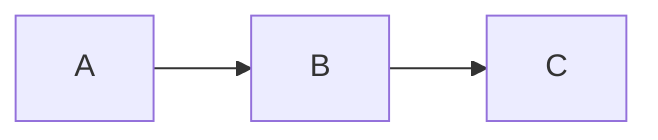

# Supported Markdown Tags

Renderer: CommonMark + GFM + extensions (remark/rehype pipeline).

---

## Front Matter
YAML front matter at the top of the file is silently stripped — never rendered.
```
---
title: "My Article"
author: "Raghava"
date: 2026-06-15
tags: [react, markdown]
---
```
Must be the very first thing in the file. Only YAML (`---`) is supported; TOML (`+++`) is not.

## Headings
`#` through `######` — H1 to H6. All six levels supported.

## Emphasis
| Syntax | Result |
|--------|--------|
| `**text**` or `__text__` | Bold |
| `*text*` or `_text_` | Italic |
| `***text***` | Bold + Italic |
| `~~text~~` | Strikethrough |
| `` `code` `` | Inline code |

## Links & Images
| Syntax | Notes |
|--------|-------|
| `[text](url)` | Inline link |
| `[text](url "title")` | With tooltip |
| `[text][ref]` + `[ref]: url` | Reference link |
| `<https://url>` or bare `https://url` | Autolink |
| `` | Image |

Blocked URL protocols: `javascript:` `data:` `vbscript:` `file:`  
External links open in new tab with `noopener noreferrer`.

## Lists
```
- unordered  (* or + also work)
1. ordered   (custom start index supported)
- [x] task checked
- [ ] task unchecked
```
Lists are nestable.

## Blockquote
```
> text
>> nested quote
```

## Code Blocks
Fenced with optional language for syntax highlighting:
````
```javascript
code here
```
````
Supported languages include: js/ts, python, rust, go, java, css, html, json, sql, bash, and all highlight.js languages.

Indented (4 spaces) also works but has no syntax highlighting.

## Tables
```
| Header | Header |
|--------|:------:|
| left   | center |
```
Column alignment: `---` left · `:---:` center · `---:` right

## Math — KaTeX
Inline: `$E = mc^2$`  
Block:
```
$$
\frac{-b \pm \sqrt{b^2-4ac}}{2a}
$$
```

## Mermaid Diagrams
````

````
Supported types: `flowchart` `sequenceDiagram` `gantt` `pie` `classDiagram` `stateDiagram` `erDiagram` `journey` `timeline` `mindmap`

Themes automatically match the active md-view color palette.

## Collapsible — `<details>`
```html
<details>
  <summary>Click to expand</summary>
  Hidden content.
</details>

<details open>
  <summary>Expanded by default</summary>
  Visible on load.
</details>
```

## Callout (custom element)
```html
<callout icon="💡">
  Use for tips, warnings, and important notes.
</callout>
```
`icon` is optional. Renders with a styled background distinct from blockquotes.

## Horizontal Rule
`---` or `***` or `___`

## Line Breaks
- Single newline → space (soft break)
- Line ending with `\` or two trailing spaces → `<br>` (hard break)

## Raw HTML
Passthrough HTML is sanitized. Safe elements allowed: `<details>` `<summary>` `<callout>` `<input>` plus all standard HTML.  
Stripped: `<script>` `<style>` `<iframe>` `<object>` `<embed>` and all event attributes.

---

## Not Supported
`==highlight==` · `~subscript~` · `^superscript^` · `:emoji-shortcode:` (use emoji directly 😊) · definition lists · underline (no markdown syntax; `<u>` HTML works)
